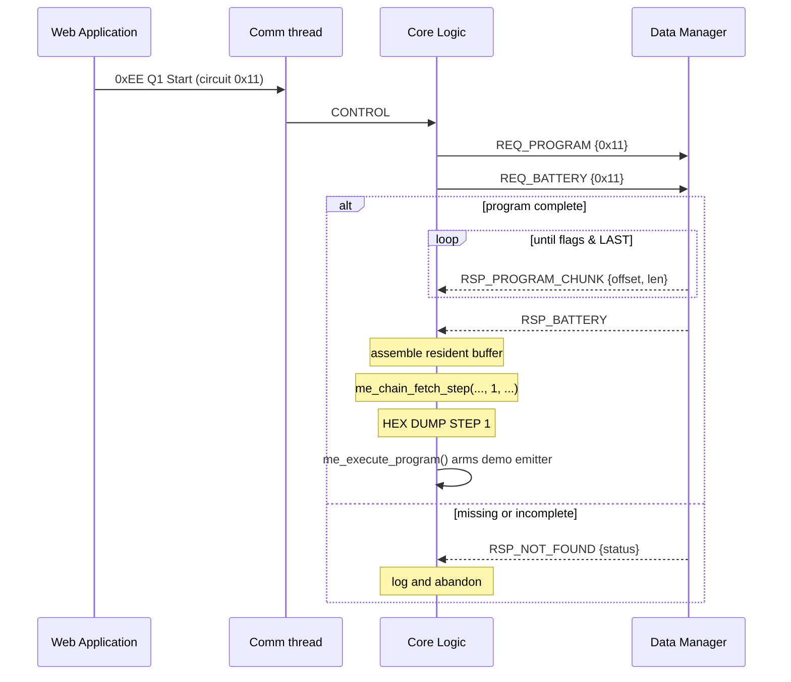
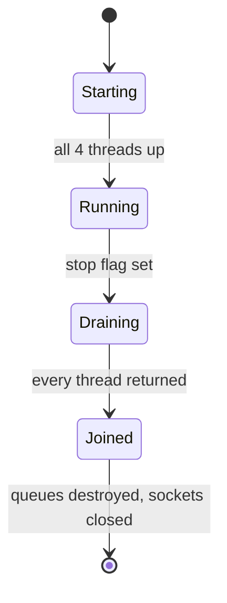

# ME Primary Board — Battery Testing Application
## Functional / Workflow Diagram (4-thread architecture)

> Milestone: build the threading and message-passing base for the Battery
> Testing Application, up to and including **extracting and printing program
> step 1** and a **60-second dummy real-time emitter** that proves the whole
> loop end-to-end on the Web Application. Real step execution is deliberately
> left unwritten.
>
> Target: Toradex Verdin iMX8M Plus (Cortex-A53, aarch64) running Torizon OS.
>
> Companion document: `ME_Primary_Comm_Block_Diagram.md` covers the
> Communication thread and the `0xDD` device registration that this builds on.
> Read that first if you have not.
>
> **Revised 2026-08-12.** Three changes since the 2026-08-11 base:
> `Ref Docs/bm_config_v6.0.md` now exists, so the `0xAA` battery payload is
> **40 bytes with all 12 fields stored** rather than 22 with 18 silently discarded
> (§4.2, open item 1); the router's length table covers **`0xAA`** (§12 decision
> 20); and one `0xCC` frame is now sent **per successful registration** as demo
> scaffolding (§6.6.1). Still **not run on hardware.**

This document is written to be read top-to-bottom by any embedded developer.
Diagrams are given in plain ASCII first, so nothing needs rendering. Mermaid
versions follow where they add something.

---

## 0. What already exists, and what this adds

Device registration over TCP 9999 is **complete and hardware-verified**
(2026-08-10). The board connects, sends the 33-byte `0xDD` frame, accepts
`0x01` or `0x02` as success, and then holds `ME_COMM_IDLE` with the connection
open, polling three sockets.

That idle state is the hook. Everything in this document hangs off it.

```
   BEFORE (shipped)                    AFTER (this document)

   main                                main
    |                                   |
    +-- comm thread                     +-- comm thread      (extended)
         |                              +-- core logic thread    (new)
         +-- CONNECTING                 +-- data manager thread  (new)
         +-- REGISTERING                +-- can manager thread   (new stub)
         +-- IDLE  <-- nothing               |
              arrives here                   +-- 4 in-process message queues
```

---

## 1. Thread topology

Four threads. Each owns one **inbox** queue — one place to wait, so every
thread's main loop is a single receive and a `switch`.

```
                              WEB APPLICATION
                 TCP 9999        UDP 10000        UDP 10001
                     ^               ^                ^
                     |               |                |
    =================|===============|================|==================
                     v               v                v
      +--------------+---------------+----------------+---------------+
      |                    COMMUNICATION THREAD                       |
      |                                                               |
      |   poll() over 4 descriptors:                                  |
      |       tcp_fd  udp_live_fd  udp_sess_fd  q_comm.evt_fd         |
      |                                                               |
      |   inbound : classify by start byte -> route to a queue        |
      |   outbound: drain q_comm -> sendto() on the right UDP port    |
      +-----+---------------------+-----------------------+-----------+
            |                     |                       ^
            | STORE_PROGRAM       | CONTROL               | REALTIME_DATA
            | STORE_BATTERY       |                       | SESSION_DATA
            | STORE_CONFIG        |                       |
            v                     v                       |
      +-----+--------+     +------+-------+               |
      |    q_data    |     |    q_core    |               |
      +-----+--------+     +------+-------+               |
            |                     |                       |
            v                     v                       |
   +--------+---------+  +--------+-----------+           |
   |  DATA MANAGER    |  |    CORE LOGIC      |           |
   |     THREAD       |  |      THREAD        |           |
   |                  |  |                    |           |
   |  g_program[64]   |  |  resident program  |           |
   |  g_battery[64]   |  |  buffer per circuit|           |
   |  g_config[64]    |  |  battery struct    |           |
   |  session ring    |  |  config struct     |           |
   +---+----------+---+  +----+----------+----+           |
       |          ^           |          |                |
       |          |           |          |                |
       |          +-----------+          |                |
       |   REQ_PROGRAM / REQ_BATTERY     |                |
       |                                 |                |
       |          +----------+           | CAN_TX         |
       +--------->|          |<----------+                |
        RSP_*     | (to core)|                            |
                  +----------+           v                |
                                   +-----+------+         |
                                   |   q_can    |         |
                                   +-----+------+         |
                                         |                |
                                   +-----v---------+      |
                                   | CAN DATA MGR  |      |
                                   |    THREAD     |      |
                                   |   (stub)      |      |
                                   +-----+---------+      |
                                         |                |
                              CAN_DATA -> q_core, q_data  |
                                                          |
       SESSION_DATA: Core -> q_data -> ring -> q_comm -----+
```

### Responsibility, in one line each

| Thread | Owns | Never does |
|---|---|---|
| **Communication** | all three sockets, the wire protocol | interpret a program, hold test state |
| **Core Logic** | test state, program step execution | touch a socket, own persistent storage |
| **Data Manager** | all persistent per-circuit storage | parse wire frames, decide test behaviour |
| **CAN Data Manager** | the CAN interface (later) | anything, yet — it is a wired stub |

---

## 2. The queue mechanism

### 2.1 Why in-process, not POSIX `mq_open`

All four threads live in **one process**. POSIX message queues would add a
kernel round trip for no benefit, and — the deciding factor — their
`msgsize_max` defaults to **8192 bytes** and is not raisable from inside an
unprivileged container. A single `0xBB` Q4 program packet can exceed that, so
every bulk message would need chunking around a limit we did not choose.

An in-process queue has no such ceiling, needs no `/proc` tuning, and compiles
on the Windows host, so the plumbing gets unit tests without a board.

### 2.2 Structure

```c
#define ME_MSGQ_DEPTH        16u
#define ME_MSG_PAYLOAD_MAX   (64u * 1024u)

typedef struct {
    const char     *name;                  /* for log messages only        */
    me_msg_t        slot[ME_MSGQ_DEPTH];
    unsigned        head, tail, count;
    pthread_mutex_t lock;
    pthread_cond_t  not_empty;
    pthread_cond_t  not_full;
    int             evt_fd;                /* -1 unless poll()-backed      */
    unsigned long   sent, received, dropped;
} me_msgq_t;

bool me_msgq_init(me_msgq_t *q, const char *name, bool pollable);
void me_msgq_destroy(me_msgq_t *q);

bool me_msgq_send(me_msgq_t *q, const me_msg_t *m, int timeout_ms);
bool me_msgq_recv(me_msgq_t *q, me_msg_t *out,     int timeout_ms);

int  me_msgq_fd(const me_msgq_t *q);       /* evt_fd, or -1                */
void me_msgq_ack_event(me_msgq_t *q);      /* clear the eventfd counter    */
```

`me_msgq_ack_event()` exists so the Communication thread never touches
`q->evt_fd` directly. A caller that read the descriptor itself would be one
refactor away from clearing the counter without draining the slots — which
loses every queued message silently until the next send re-arms `poll()`.

Four queues at depth 16 with a 64 KB payload each is ~4 MB of `.bss`. On Linux
that is demand-zero — it costs address space, not physical memory, until a slot
is actually written. `send`/`recv` copy only `m->len` payload bytes, never the
full 64 KB.

### 2.3 The Communication thread cannot block on a queue

It is already blocked in `poll()` on three sockets. So `q_comm` — and only
`q_comm` — carries an **eventfd**. `me_msgq_send()` writes 8 bytes to it,
`poll()` wakes on `POLLIN`, the thread drains the queue and the counter.

```
   Core Logic                          Communication thread
       |                                        |
       |  me_msgq_send(&q_comm, ...)            |  poll([tcp, udp0, udp1, evt_fd])
       |     enqueue slot                       |     blocked
       |     write(evt_fd, &1, 8) --------------+---> POLLIN on evt_fd
       |                                        |
       |                                        |  read(evt_fd)  -> clears counter
       |                                        |  while (me_msgq_recv(&q_comm, &m, 0))
       |                                        |      sendto(udp_live_fd, ...)
```

The asymmetry is hidden inside `me_msgq_t`. Core Logic and the Data Manager
call the same `me_msgq_send()` they use for every other queue and never learn
that this one is special.

`eventfd` is the idiomatic Linux answer to "wait on sockets *and* an in-process
event." A self-pipe would also work but costs two descriptors and moves real
bytes; `eventfd` is one descriptor holding a 64-bit counter.

### 2.4 Deadlock is prevented by construction

**Rule: every send has a finite timeout. No thread ever blocks forever.**

`me_msgq_send(q, m, timeout_ms)` returns `false` on timeout; the message is
dropped, `q->dropped` increments and the drop is logged with the queue name and
message type. A full queue therefore degrades into a visible, counted loss —
never a hang.

Two specific hazards and their answers:

| Hazard | Answer |
|---|---|
| Core Logic blocked sending to `q_data` while the Data Manager is blocked sending to `q_core` | Both sends time out. Additionally, after issuing `REQ_PROGRAM` Core Logic only *receives* until the transfer ends, so it is not sending during a chunk stream. |
| A chunk is dropped mid-transfer, leaving Core Logic with a corrupt program | Every chunk carries an absolute `offset`. Core Logic asserts `offset == expected`; a mismatch aborts the transfer, marks the circuit's program invalid, and logs. Silent corruption is not possible. |

Timeouts: **50 ms** for small control and request messages, **500 ms** for bulk
chunk messages, **200 ms** on every receive so threads notice a stop request
promptly.

---

## 3. Message catalogue

```c
typedef enum {
    ME_MSG_NONE = 0,

    /* Communication -> Data Manager */
    ME_MSG_STORE_PROGRAM,        /* one 0xBB Q4 step-data payload          */
    ME_MSG_STORE_BATTERY,        /* 0xAA battery-info payload              */
    ME_MSG_STORE_CONFIG,         /* 0xAA configuration payload             */

    /* Communication -> Core Logic */
    ME_MSG_CONTROL,              /* 0xEE frame, whole                      */

    /* Core Logic -> Data Manager */
    ME_MSG_REQ_PROGRAM,
    ME_MSG_REQ_BATTERY,

    /* Data Manager -> Core Logic */
    ME_MSG_RSP_PROGRAM_CHUNK,    /* offset + len + ME_MSG_FLAG_LAST        */
    ME_MSG_RSP_BATTERY,
    ME_MSG_RSP_NOT_FOUND,        /* status says which request, and why     */

    /* Core Logic -> Communication */
    ME_MSG_REALTIME_DATA,        /* 0xCC frame -> UDP 10000                */

    /* Core Logic -> Data Manager -> Communication */
    ME_MSG_SESSION_DATA,         /* 0xCC frame -> UDP 10001                */

    /* Core Logic <-> CAN Data Manager  (provision only) */
    ME_MSG_CAN_TX,
    ME_MSG_CAN_DATA,

    ME_MSG_TYPE_COUNT
} me_msg_type_t;

#define ME_MSG_FLAG_LAST  0x01u   /* final chunk of a multi-part transfer  */

typedef enum {
    ME_STATUS_OK = 0,
    ME_STATUS_NO_PROGRAM,          /* nothing stored for that circuit      */
    ME_STATUS_PROGRAM_INCOMPLETE,  /* stored, but no terminator seen yet   */
    ME_STATUS_PROGRAM_INVALID,     /* chain walk failed on it              */
    ME_STATUS_NO_BATTERY,          /* no battery data stored               */
    ME_STATUS_BAD_CIRCUIT          /* CircuitID did not map to a slot      */
} me_msg_status_t;

typedef struct {
    me_msg_type_t type;
    uint8_t       circuit_id;    /* raw byte: 0x11 = Secondary 1, Ch 1     */
    uint8_t       flags;
    uint16_t      status;        /* me_msg_status_t, 0 = OK                */
    uint32_t      offset;        /* byte offset for chunked transfers      */
    uint32_t      len;           /* valid bytes in payload[]               */
    uint8_t       payload[ME_MSG_PAYLOAD_MAX];
} me_msg_t;
```

### Routing table

| Type | From | To | Carries |
|---|---|---|---|
| `STORE_PROGRAM` | Comm | Data | `0xBB` Q4 step bytes |
| `STORE_BATTERY` | Comm | Data | `0xAA` battery payload |
| `STORE_CONFIG` | Comm | Data | `0xAA` config payload |
| `CONTROL` | Comm | Core | whole `0xEE` frame |
| `REQ_PROGRAM` | Core | Data | — |
| `REQ_BATTERY` | Core | Data | — |
| `RSP_PROGRAM_CHUNK` | Data | Core | program bytes at `offset` |
| `RSP_BATTERY` | Data | Core | parsed battery struct |
| `RSP_NOT_FOUND` | Data | Core | `status` = reason |
| `REALTIME_DATA` | Core | Comm | `0xCC` frame, UDP 10000 |
| `SESSION_DATA` | Core | Data | `0xCC` frame, into the ring |
| `SESSION_DATA` | Data | Comm | `0xCC` frame, UDP 10001 |
| `CAN_TX` | Core | CAN | CAN-FD frame |
| `CAN_DATA` | CAN | Core, Data | inbound CAN payload |

### A naming trap, fixed deliberately

The traffic on **UDP 10001** is called "Registration data" in
`bm_measured_param_v5.2` — it is a `0xCC` frame with a 4-byte Session ID
prefix, emitted while a test runs.

It has **nothing to do with the `0xDD` device registration** completed on
2026-08-10. Two unrelated things share the word "registration" in the source
documents. This design calls the UDP 10001 traffic `SESSION_DATA` throughout so
that nobody ever wires it into the `0xDD` path by name association.

---

## 4. Circuit addressing and storage

### 4.1 CircuitID → storage slot

```
    bit  7   6   5   4     3   2   1   0
       +---------------+---------------+
       |   Secondary   |    Channel    |
       +---------------+---------------+

    0x11 -> Secondary 1, Channel 1 -> slot 0
    0x18 -> Secondary 1, Channel 8 -> slot 7
    0x21 -> Secondary 2, Channel 1 -> slot 8
    0x88 -> Secondary 8, Channel 8 -> slot 63
```

```c
#define ME_MAX_SECONDARIES   8u
#define ME_MAX_CHANNELS      8u
#define ME_MAX_CIRCUITS      (ME_MAX_SECONDARIES * ME_MAX_CHANNELS)  /* 64 */

#define ME_PROGRAM_BUF_SIZE  (2u * 1024u * 1024u)   /* 2 MB, per circuit  */

#define ME_SLOT_INVALID      (-1)

int me_circuit_slot(uint8_t circuit_id);   /* -1 if malformed */
```

**The nibbles are 1-based.** `slot = (sec - 1) * ME_MAX_CHANNELS + (ch - 1)`,
and `sec == 0`, `ch == 0`, `sec > 8`, `ch > 8` all return `ME_SLOT_INVALID` and
are logged. They must *not* fold into slot 0 — a malformed CircuitID silently
writing over Secondary 1 Channel 1's program is exactly the class of bug that
takes a week to find.

### 4.2 Static footprint

```c
static uint8_t  g_program[ME_MAX_CIRCUITS][ME_PROGRAM_BUF_SIZE];  /* 128 MB */
static uint32_t g_program_len[ME_MAX_CIRCUITS];
static bool     g_program_complete[ME_MAX_CIRCUITS];

static me_battery_t g_battery[ME_MAX_CIRCUITS];
static me_config_t  g_config[ME_MAX_CIRCUITS];
```

`me_battery_t` widened from 7 fields to **12** on 2026-08-12, when
`bm_config_v6.0.md` revealed the `0xAA` Q5 payload is 40 bytes rather than the 22
the legacy layout implemented. Because the store holds the struct **by value**,
`circuit_store.c` needed no change at all — the per-circuit record simply got
wider, and the CircuitID→slot mapping in §4.1 kept working unaltered:

```c
typedef struct {
    bool     valid;
    float    nom_capacity;          uint8_t no_of_cells;
    float    gassing_voltage;       float   max_voltage;
    float    nom_current;           float   cold_cranking_current;
    uint8_t  charge_factor;
    /* the 18 bytes the legacy 22-byte layout discarded: */
    float    impedance;             float   break_voltage;
    float    nom_voltage;           float   energy_density;
    uint16_t battery_id;
} me_battery_t;
```

**This is how battery data is stored per Secondary/Channel**, and it is the same
shape of storage the program buffers use: `0xAA` Q5 arrives → `route_frame()`
admission-checks the CircuitID and verifies the CRC → `STORE_BATTERY` to
`q_data` → the Data Manager parses and calls `me_store_battery_set()` → the
record lands in `g_battery[slot]`. Core Logic pulls it back with `REQ_BATTERY`
when a test starts, and caches it in its own per-circuit state.

Core Logic holds a mirror, per your requirement that each started program lives
in its own resident buffer so the step walker runs against it unchanged:

```c
static uint8_t  g_cl_program[ME_MAX_CIRCUITS][ME_PROGRAM_BUF_SIZE]; /* 128 MB */
static uint32_t g_cl_program_len[ME_MAX_CIRCUITS];
```

256 MB of `.bss` total. This is affordable because Linux `.bss` is
demand-zero-paged: it reserves address space, and a page costs physical memory
only when first written. The binary itself does not grow — `.bss` contributes
no file bytes. If real programs are 50 KB, resident memory is roughly
`64 x 50 KB x 2 = 6.4 MB`, not 256 MB.

> **Verify on hardware.** Docker memory limits count RSS. Run `docker stats`
> with several circuits loaded before assuming the headroom is there. Both
> sizes are macros precisely so this can be tuned without a redesign.

**The host test build overrides the size:**
`build-native.ps1` compiles with `-DME_PROGRAM_BUF_SIZE=65536`. Windows commits
`.bss` where Linux only reserves it, so the unmodified 256 MB would be a real
allocation on the laptop.

---

## 5. The program serial buffer

### 5.1 Wire format inside the buffer

A program is **not** an array of packets. It is a singly-linked list embedded in
a byte array — each step names the absolute offset of the next.

```
 offset  0     1     2  3  4  5     6  7     8        ...      n-2  n-1
        +-----+-----+-----------+---------+-----+-------------+----+----+
        | AA  | 55  | nextIndex | stepNo  | op  |   step data | 55 | AA |
        |  start    |  4B, BE   |  2B, BE | 1B  |             |  end    |
        +-----+-----+-----------+---------+-----+-------------+----+----+
```

```
  buffer:
  0x0000  AA 55 | 00 00 00 2E | 00 01 | op ... | 55 AA     step 1, next @ 0x2E
  0x002E  AA 55 | 00 00 00 5C | 00 02 | op ... | 55 AA     step 2, next @ 0x5C
  0x005C  AA 55 | FF FF FF FF | 00 03 | op ... | 55 AA     step 3, TERMINATOR
                      ^^^^^^^^^^^
                      0xFFFFFFFF = no next step = program complete
```

| Constant | Value |
|---|---|
| `ME_STEP_START_1`, `ME_STEP_START_2` | `0xAA`, `0x55` |
| `ME_STEP_END_1`, `ME_STEP_END_2` | `0x55`, `0xAA` |
| `ME_STEP_TERMINATOR` | `0xFFFFFFFF` |
| `ME_STEP_OPERATOR_OFF` | `8` |

> **`0xAA` means two different things.** It is the start byte of a
> *Configuration* frame on the TCP stream, and it is also the first byte of a
> *step packet* inside the program buffer. These are separate namespaces — a
> step packet never appears on the wire on its own, and a config frame never
> appears inside the program buffer. Keep the constants separately named
> (`ME_START_CONFIG` vs `ME_STEP_START_1`) so the collision stays harmless.

### 5.2 The chain walker

Ported from `fetchProgramStep()` in the old
`BTS_Primary_SOM/src/networkDataHandler.c`, with two deliberate changes.

```c
typedef enum {
    ME_CHAIN_OK = 0,
    ME_CHAIN_NOT_FOUND,
    ME_CHAIN_BAD_NEXT_INDEX,
    ME_CHAIN_BAD_END_SEQ,
    ME_CHAIN_TRUNCATED
} me_chain_result_t;

me_chain_result_t me_chain_fetch_step(const uint8_t *buf, uint32_t buf_len,
                                      uint32_t step_no,
                                      const uint8_t **step_out,
                                      uint32_t *step_len_out);

bool me_chain_is_complete(const uint8_t *buf, uint32_t buf_len);
```

Walk: start at offset 0, confirm `AA 55`, read `nextIndex`, treat
`startOfNext = (nextIndex == TERMINATOR) ? buf_len : nextIndex`, check
`55 AA` at `startOfNext - 2`, and either return this step or jump to
`startOfNext` and increment the counter.

**Kept from the old code:** steps are counted **positionally** as the walk
proceeds, not read from the `stepNo` field at offset +6. A program with
mislabelled step numbers still executes in buffer order. That was the right
call and it stays.

**Changed:** the walker takes `buf` and `buf_len` as parameters instead of
reaching for a file-scope `programDataBuffer` and a global
`totalProgramDataLength`. That is what makes it a pure function the host test
suite can hammer with synthetic and malformed chains, and it is what lets Core
Logic run the identical code against its own resident buffer.

### 5.3 Completion detection

The old firmware learned a transfer was finished by counting `0xBB` Q4 packets
against the total that `0xBB` Q3 had announced. **Q3 no longer exists** in ME —
the Web Application sends program packets directly.

So completion is read out of the chain itself: after appending each
`STORE_PROGRAM` payload, the Data Manager walks from offset 0 and marks the
circuit complete when it reaches a step whose `nextIndex` is
`0xFFFFFFFF` **and** whose end sequence checks out.

```
   append payload -> g_program[slot]
        |
        v
   me_chain_is_complete(g_program[slot], g_program_len[slot]) ?
        |                        |
       no                       yes
        |                        |
   wait for more          g_program_complete[slot] = true
   packets                log "program complete: N steps, M bytes"
```

Because `nextIndex` is an **absolute** offset into the program buffer, the Data
Manager must append payloads **contiguously from offset 0**. It does — there is
no per-packet framing added on the way in, so the Web Application's offsets stay
valid without fix-up. Appending anything between packets would corrupt every
offset in the chain.

---

## 6. Workflows

### 6.1 Program load

```
  WEB APP            COMM THREAD              DATA MANAGER
     |                    |                        |
     |-- 0xBB Q4 #1 ----->|                        |
     |                    | verify CRC             |
     |                    | route by start byte    |
     |                    |-- STORE_PROGRAM ------->|
     |                    |                        | slot = me_circuit_slot()
     |                    |                        | bounds-check append
     |                    |                        | g_program_len += len
     |                    |                        | is_complete? no
     |                    |                        |
     |-- 0xBB Q4 #2 ----->|-- STORE_PROGRAM ------->|
     |                    |                        | is_complete? no
     |                    |                        |
     |-- 0xBB Q4 #3 ----->|-- STORE_PROGRAM ------->|
     |                    |                        | is_complete? YES
     |                    |                        | mark COMPLETE, log
     |                    |                        |
```

A fresh `0xBB` Q4 arriving for a circuit already marked complete **resets**
that circuit: `g_program_len = 0`, `complete = false`, then append. That is how
a re-sent program replaces the old one rather than being concatenated onto it.

### 6.2 Start command — the milestone flow

```
  WEB APP        COMM         CORE LOGIC              DATA MANAGER
     |             |               |                       |
     |- 0xEE Q1 -->|               |                       |
     |   Start     |-- CONTROL --->|                       |
     |             |               | circuit = frame[2]    |
     |             |               |                       |
     |             |               |-- REQ_PROGRAM ------->|
     |             |               |-- REQ_BATTERY ------->|
     |             |               |                       | complete? yes
     |             |               |<-- RSP_PROGRAM_CHUNK -| offset 0
     |             |               |<-- RSP_PROGRAM_CHUNK -| offset 65536
     |             |               |<-- RSP_PROGRAM_CHUNK -| offset 131072
     |             |               |     (flags = LAST)    |
     |             |               |<-- RSP_BATTERY -------|
     |             |               |                       |
     |             |               | assemble into
     |             |               |   g_cl_program[slot]
     |             |               |
     |             |               | me_chain_fetch_step(buf, len, 1, ...)
     |             |               |        |
     |             |               |        +--> hex dump step 1  <== MILESTONE
     |             |               |
     |             |               | me_execute_program(circuit)
     |             |               |        +--> arms the demo emitter (6.6)
```

If the program is absent or incomplete, the Data Manager answers
`RSP_NOT_FOUND` with a status of `ME_STATUS_NO_PROGRAM` or
`ME_STATUS_PROGRAM_INCOMPLETE`, and Core Logic logs and abandons the Start. It
does not retry — a Start for a circuit with no program is an operator error,
not a transient fault.

Mermaid version:



### 6.3 Session data — Core → Data Manager → Comm → UDP 10001

The Data Manager holds these in a ring buffer and forwards when it can, so a
burst of session records does not stall Core Logic.

```
   CORE LOGIC              DATA MANAGER                COMM THREAD
       |                        |                          |
       |-- SESSION_DATA ------->|                          |
       |                        | ring_push()              |
       |                        |                          |
       |                        | each loop iteration:     |
       |                        |   while ring not empty   |
       |                        |     SESSION_DATA ------->| write(evt_fd)
       |                        |     (on send failure,    |
       |                        |      leave it in ring)   | sendto(udp_sess)
```

The ring is `ME_SESSION_RING_DEPTH = 64` frames. On overflow the **oldest**
record is dropped and counted — session data is a running log, so losing the
oldest entry is strictly better than refusing the newest.

### 6.4 Real-time data — Core → Comm → UDP 10000

Direct, no ring. Real-time data is only meaningful while fresh; if `q_comm` is
full the frame is dropped and counted rather than queued behind stale ones.

In this milestone the frames come from the **demo emitter** in 6.6, not from
real program execution. The transport path is identical either way — when real
execution lands it replaces the source of the frames and nothing else.

**One thing genuinely missing today:** both UDP sockets are open but have never
had a destination. `sendto()` needs the Web Application's address, which
`sys_init` already holds from `--server`, paired with `ME_PORT_UDP_LIVE` and
`ME_PORT_UDP_SESSION`. Building those two `sockaddr_in` values at init and
storing them alongside the descriptors is part of this milestone. Note this
also means the real-time stream goes to the **same host** the TCP connection
was made to — if the Web Application ever listens for UDP on a different host,
that becomes a separate argument.

### 6.5 CAN Data Manager — provision only

```
   CORE LOGIC                       CAN DATA MANAGER
       |                                   |
       |-- CAN_TX {frame} ---------------->|  log + drop  (no hardware yet)
       |                                   |
       |<-- CAN_DATA ----------------------|  never sent yet
       |                                   |
   DATA MANAGER                            |
       |<-- CAN_DATA ----------------------|  never sent yet
```

The thread runs, owns `q_can`, receives with a timeout, honours the stop flag,
and logs anything it gets. Both message types are defined and both receive paths
are written, so when the CAN interface lands it is a matter of filling in one
thread, not threading a new path through three others.

### 6.6 The demo real-time emitter — TEMPORARY

**Purpose: prove the whole loop is alive.** A Start command arriving on TCP
9999 should visibly move a number on the Web Application within a second. Until
step execution exists there is nothing to measure, so Core Logic synthesises a
plausible `0xCC` frame once per second for 60 seconds and then stops.

```
   t=0s    0xEE Q1 Start (circuit 0x11) arrives
             |
             +-- program fetched, step 1 hex-dumped
             +-- me_execute_program() arms the emitter
             |
   t=1s    REALTIME_DATA  current =  1.0 A  -->  q_comm --> UDP 10000
   t=2s    REALTIME_DATA  current =  2.0 A  -->  q_comm --> UDP 10000
   t=3s    REALTIME_DATA  current =  3.0 A  -->  q_comm --> UDP 10000
     ...
   t=60s   REALTIME_DATA  current = 60.0 A
             |
             +-- final frame: Program Running Status = 0x00 (Idle)
             |                Circuit Status         = 0x00 (Idle)
             |
             +-- circuit 0x11 -> ME_TEST_STOPPED, emitter disarmed
   t=61s+  silence
```

The ramping **Current** field is the one that moves; everything else is either
fixed or derived from it, so a changing number on the Web Application means the
full path — TCP command in, queue, Core Logic, queue, eventfd, UDP out — is
working. A frozen number localises the fault to the emitter; no number at all
localises it to the transport.

#### Per-circuit demo state

```c
typedef enum {
    ME_TEST_IDLE = 0,
    ME_TEST_RUNNING,
    ME_TEST_STOPPED     /* ran to completion; stays here until a new Start */
} me_test_state_t;

typedef struct {
    me_test_state_t state;
    uint32_t        tick;          /* 1..60                                */
    uint64_t        next_tick_ms;  /* CLOCK_MONOTONIC deadline             */
    float           current_a;     /* the value that ramps                 */
} me_demo_test_t;

static me_demo_test_t g_demo[ME_MAX_CIRCUITS];
```

```c
#define ME_DEMO_TICK_MS         1000u    /* one frame per second           */
#define ME_DEMO_DURATION_MS    60000u    /* then stop                      */
#define ME_DEMO_CURRENT_START    0.0f
#define ME_DEMO_CURRENT_STEP     1.0f    /* +1 A per frame                 */
#define ME_DEMO_VOLTAGE         48.0f    /* fixed                          */
#define ME_DEMO_TEMPERATURE     25.0f    /* fixed                          */
```

#### Where the 1 Hz comes from

No timer thread and no `timerfd`. Core Logic already blocks in
`me_msgq_recv(&q_core, timeout_ms)`, so the timeout **is** the timer:

```c
for (;;) {
    int timeout = me_demo_ms_until_next_tick();   /* capped at 200 ms */
    if (me_msgq_recv(&q_core, &m, timeout))
        handle_message(&m);
    me_demo_service();          /* emit for every circuit now due */
    if (me_comm_thread_stop_requested()) break;
}
```

`me_demo_ms_until_next_tick()` returns the smallest remaining time across all
running circuits, clamped to the 200 ms stop-responsiveness ceiling. With no
circuit running it returns 200 ms and the loop behaves exactly as it does
today. Deadlines are absolute (`next_tick_ms += ME_DEMO_TICK_MS`) rather than
"now + 1000", so scheduling jitter does not accumulate over the 60 frames.

#### The `0xCC` frame it builds

86 bytes: 4 header + 80 payload + 2 CRC, per `bm_measured_param_v5.2`. Header
is `CC | DeviceID | CircuitID | 0x01`.

| Payload off | Field | Demo value |
|---|---|---|
| 0 | Step Number | `1` |
| 2 | Program Running Status | `0x01` Running → `0x00` on the final frame |
| 3 | Circuit Status | `0x01` Charge → `0x00` on the final frame |
| 4 | User ERR/MSG | `0` |
| 5 | Exception / Error ID | `0` |
| 9 | Step Running Time | `tick * 1000` ms |
| 13 | Program Running Time | `tick * 1000` ms |
| **17** | **Current** | **`tick * 1.0` A — the value that moves** |
| 21 | Voltage | `48.0` V |
| 25 | Temperature | `25.0` °C |
| 29 | Power | `Voltage * Current` |
| 33–64 | capacities and energies | `0.0` |
| 65 | Operator | `0x01` CCChg |
| 66–74 | cycle and table fields | `0` / `1` |
| 75 | Registration type | `0` |
| 77–79 | digital I/O | `0` |

Floats are **IEEE 754 single-precision, big-endian** — `95.6f` encodes as
`42 BF 33 33`, matching the worked example in the spec. CRC-16/Modbus over
bytes 0–83, appended high byte first per ADR-9.

#### Stop semantics

Two ways the demo ends, and they converge:

| Trigger | Effect |
|---|---|
| 60 frames sent | final frame carries Idle status, circuit → `ME_TEST_STOPPED` |
| `0xEE` Q2 Stop arrives | emitter disarmed immediately, circuit → `ME_TEST_STOPPED` |

`ME_TEST_STOPPED` is where that Secondary/Channel stays. It emits nothing
further, and a `0xEE` Q3 Pause or Q4 Continue for a stopped circuit is logged
and ignored. A **fresh `0xEE` Q1 Start re-runs the demo** from tick 1 — that is
deliberate, so the flow can be re-demonstrated without restarting the
application. If you would rather a stopped circuit refuse further Starts until
the program is re-sent, say so and it is a one-line change.

#### 6.6.1 The post-registration frame — also TEMPORARY

Added **2026-08-12** at the developer's request. The 1 Hz emitter above only
starts on an `0xEE` Q1 Start, so until a program has been sent and started the
live path is silent. To give the Web Application something to display as soon as
a circuit exists, **one** `0xCC` frame is sent immediately after that circuit's
device registration succeeds:

```
do_registration() returns true
   -> me_registry_mark_registered(0x11)      admission control
   -> print_registered_banner()
   -> me_demo_send_post_registration(0x11)   <-- one frame, then nothing
        -> me_realtime_pack_post_registration()
        -> ME_MSG_REALTIME_DATA on g_q_comm
        -> idle_loop() poll() wakes on the eventfd
        -> drain_outbound() -> me_udp_send_to(udp_live_fd, udp_live_dest)
                                                            = UDP 10000
```

| | |
|---|---|
| Contents | `step_number = 1`, `temperature = 25.0 °C`, **every other field zero** |
| Status bytes | both **Idle** — nothing is running at registration time |
| Length / CRC | 86 bytes, CRC **`0xF261`** big-endian |
| When | **every** successful registration, so a reconnect sends another |
| Transport | UDP 10000, the documented `0xCC` destination |

The exact bytes were supplied by the developer and are asserted in
`test_post_registration_frame_matches_the_developer_bytes()`. The frame is
**built** from `me_realtime_t` rather than copied from a byte array, so it
addresses whatever `--secondary`/`--channel` the board was started with; a second
test runs it for device `0x07` / circuit `0x32` to prove that.

Two structural points worth knowing:

- The byte layout lives in **`realtime_frame.c`**, not `demo_realtime.c`, because
  that module is pure and therefore host-testable — `demo_realtime.c` is
  Linux-only and excluded from `build-native.ps1`. Putting it there is what lets
  the exact frame be proven on the laptop instead of discovered on hardware.
- `me_demo_send_post_registration()` is the **only** function in `demo_realtime.*`
  called from the **Communication** thread; everything else is Core Logic's. It
  therefore has its **own** message buffer (`s_tx_postreg`). Sharing the emitter's
  `s_tx` would be a data race against `me_demo_service()`.

#### Quarantine

This code is temporary and is kept in **one file**,
`src/threads/demo_realtime.c`, behind:

```c
#define ME_DEMO_REALTIME 1      /* set to 0 to compile the demo out entirely */
```

`me_execute_program()` stays the seam for real execution. For this milestone
its whole body is `me_demo_arm(circuit)`. When real step execution arrives,
that call is replaced and `demo_realtime.c` is deleted — not gradually
disentangled from Core Logic, because it was never entangled with it.

Deleting the file leaves **two** dangling references, both of which are
compile errors rather than silent dead code — deliberately, so neither can be
forgotten:

| Reference | Location |
|---|---|
| `me_demo_send_post_registration()` call + `#include` | `comm_thread.c`, end of `do_registration()` |
| `me_realtime_pack_post_registration()` | `realtime_frame.c/.h` — delete the function too |

---

## 7. Thread lifecycle

```
   main()
     |
     | 1. parse args, install SIGINT/SIGTERM handlers
     | 2. sys_init: board identity, UDP sockets, registration request
     | 3. me_msgq_init  x4     (q_comm pollable, others not)
     | 4. circuit_store_init   (zero the metadata, not the 128 MB)
     |
     | 5. pthread_create: data manager
     |    pthread_create: can manager
     |    pthread_create: core logic
     |    pthread_create: communication      <-- last, so consumers are ready
     |
     | 6. pthread_join x4
     | 7. me_msgq_destroy x4, close sockets, exit
     v
```

Start order matters: the Communication thread is created **last** so that no
frame can arrive before the queue consumers exist. Stop order is the mirror.

**Shutdown.** `SIGINT`/`SIGTERM` sets one flag (async-signal-safe, as today).
Every thread receives with a 200 ms timeout, so each notices within 200 ms and
returns. `me_msgq_destroy()` wakes anyone still waiting via broadcast. No
thread is ever cancelled — `pthread_cancel` with a mutex held is how you get a
deadlocked shutdown.



---

## 8. Error handling

| Condition | Response |
|---|---|
| Unknown start byte on TCP | hex dump, drop, connection kept open |
| CRC mismatch | existing behaviour — log both byte orders, drop |
| CircuitID malformed (`sec` or `ch` is 0 or > 8) | reject, log the raw byte, drop |
| Program append would exceed `ME_PROGRAM_BUF_SIZE` | reject the packet, mark circuit's program invalid, log |
| Chain walk fails (`BAD_NEXT_INDEX`, `BAD_END_SEQ`, `TRUNCATED`) | circuit's program marked invalid; Start answers `RSP_NOT_FOUND` |
| Queue full on send | drop after timeout, increment `dropped`, log queue name + message type |
| Chunk arrives with unexpected `offset` | abort transfer, invalidate Core Logic's copy, log |
| `sendto()` on UDP 10000/10001 fails | log `errno` once per failure, drop the frame, keep the emitter running — a UDP send error must not stop a test |
| `0xEE` Pause/Continue for a stopped circuit | logged and ignored; no state change |
| Start for a circuit with no/incomplete program | `RSP_NOT_FOUND`; log; no retry |
| TCP peer disconnects | existing behaviour — reconnect with backoff; queues and storage survive |

**Storage survives reconnection.** A dropped TCP connection does not clear
`g_program` — a program loaded before a network blip is still there after it.

---

## 9. File structure

### Pure logic — host-testable, built by `build-native.ps1`

| File | Responsibility |
|---|---|
| `src/proto/program_chain.c/.h` | the `AA 55 … 55 AA` walker, completion check, validation |
| `src/proto/frame_router.c/.h` | classify inbound bytes → message type + circuit ID; frame-length table for `0xDD`/`0xBB`/`0xEE`/**`0xAA`**, CRC as delimiter of last resort |
| `src/proto/control_frame.c/.h` | parse `0xEE` control frames |
| `src/proto/battery_frame.c/.h` | parse the **40-byte** `0xAA` Q5 battery payload — all 12 fields (`bm_config_v6.0.md` §5.3) |
| `src/proto/realtime_frame.c/.h` | build the 86-byte `0xCC` frame; big-endian float encoding; **temporary** post-registration frame (6.6.1) |
| `src/proto/proto_defs.h` | extended: `0xBB`/`0xEE`/`0xAA` query IDs and frame lengths, step constants |
| `src/msg.h` | `me_msg_t`, `me_msg_type_t`, status codes |
| `src/util/msgq.c/.h` | the queue |
| `src/store/circuit_store.c/.h` | slot mapping + the static arrays |

### Linux-only — proven on hardware only

| File | Responsibility |
|---|---|
| `src/threads/core_logic.c/.h` | Core Logic thread |
| `src/threads/data_mgr.c/.h` | Data Manager thread |
| `src/threads/can_mgr.c/.h` | CAN Data Manager stub |
| `src/threads/demo_realtime.c/.h` | **temporary** 1 Hz / 60 s demo emitter (6.6) + one-shot post-registration frame (6.6.1) |
| `src/threads/comm_thread.c` | extended: eventfd in `poll()`, frame routing, UDP sends |
| `src/main.c` | extended: create and join four threads |

`src/proto/` stays free of socket and platform headers — that rule is what keeps
the byte-layout safety net alive, and the chain walker is the single most
valuable thing in this milestone to have under test.

**Two notes on `msgq.c` in `util/`.** It needs `pthread`, which the WinLibs
MinGW-w64 build provides through winpthreads, so it compiles on the host. But
`pthread_condattr_setclock(CLOCK_MONOTONIC)` is not available there, so timed
waits use `CLOCK_REALTIME` on both targets — a system clock step could make one
timeout fire early or late, which is acceptable for a 50–500 ms drop timeout and
is not acceptable anywhere it would affect protocol timing. If winpthreads turns
out to misbehave on timed waits, the fallback is to exclude `msgq.c` from the
native build and test it on target only; that loses coverage and would be
recorded as a decision, not done silently.

---

## 10. Testing

| Layer | Command | What it proves |
|---|---|---|
| Protocol + queue unit tests | `.\build-native.ps1` | chain walking, frame routing, parsers, slot mapping, queue semantics |
| Cross-build | `.\build.ps1` | compiles clean under `-Werror`, static `ELF64 AArch64` |
| **End-to-end** | `.\deploy.ps1` | **the only proof the system works** — developer-run |

Written test-first, per the team standard: failing test, watch it fail for the
right reason, then implement.

**Host-testable:**

- `msgq` — FIFO order, blocking receive, timeout expiry, full/empty edges,
  multi-producer interleaving, drop counting
- `program_chain` — fetch step 1 / N / last from a synthetic chain; terminator
  detection; and the malformed cases: bad end sequence, `nextIndex` past
  `buf_len`, `nextIndex` pointing backwards, truncated buffer, zero-length
  buffer, a chain claiming more steps than the buffer holds
- `frame_router` — every start byte, unknown start bytes, short frames
- `circuit_store` — `0x11 → 0`, `0x88 → 63`, and rejection of `0x01`, `0x10`,
  `0x00`, `0x99`, `0xFF`
- `control_frame`, `battery_frame` — field offsets asserted individually
- `realtime_frame` — total length is 86; every payload offset asserted
  individually; `95.6f → 42 BF 33 33` as a golden vector against the spec's own
  worked example; CRC high byte first; the Running → Idle status flip on the
  final frame
- demo ramp arithmetic — tick *n* yields current *n*·1.0 A and power
  `48.0 * current`, tick 60 is the last, and the deadline advances absolutely so
  60 ticks span 60 s with no accumulated drift

**Not host-testable, and no test will be written pretending otherwise:** thread
creation and join, `eventfd` wakeups, `poll()` behaviour, socket I/O, the real
`.bss` footprint. These are proven by `deploy.ps1` on the board.

---

## 11. What is deliberately NOT here yet

| Area | Status |
|---|---|
| Program **step execution** | `me_execute_program()` exists and arms the demo emitter instead. Next milestone. |
| Real **measured** data | The demo emitter (6.6) synthesises values. No ADC, no CAN, no Secondary involved. |
| CAN hardware / SocketCAN | Thread and queues wired; no interface opened |
| Calibration (`0xA0`) | Not started |
| `0xAA` **read** queries Q1–Q4, Q6 | Now fully specified by `bm_config_v6.0.md` §3 and §6–§8, and the router knows their lengths — but no handler answers them. They owe real data back, which is why they are deliberately **not** acknowledged (a bare "success" would claim a read that never happened). Q5 **write** is implemented. |
| `0xAA` **broadcast** queries Q7–Q10 | 2-byte header, unhandled — see open item 6 |
| `0xBB` Q5/Q6 read-back of saved program | Not started |
| Nested cycles (BEG/CYC table) | Old code has `buildCycleTable()`; not ported |
| Modbus (IF-D) | Not started |
| Power-fail persistence to storage | Old code used EEPROM; ME has a filesystem — not designed yet |

---

## 12. Open items

1. ~~**No `0xAA` specification exists.**~~ **RESOLVED 2026-08-12.** The developer
   supplied `Config Data Frame Format V6.0.xlsx`, transcribed to
   **`Ref Docs/bm_config_v6.0.md`**. The battery payload is **40 bytes, not the
   22** the legacy `storeBatteryData()` implemented, and the 18-byte tail —
   Impedance, Break Voltage, Nominal Voltage, Energy Density, Battery ID — was
   being **silently discarded on every battery packet** because the parser
   "tolerated a longer payload". Section 5.4 of that document confirms the
   layout against a captured frame; all twelve boundaries and the 46-byte total
   agree. See §12.5–§12.7 below for what the document did *not* settle.

   The document also confirms the 7-byte `0xAA` acknowledgement shape that
   `ack_frame.c` previously described as inferred, and supplies real frame
   lengths for all six circuit-scoped queries, which the router's length table
   now carries.

2. **`0xBB` Q1 (is-ready) and Q2 (metadata) — still sent?** You confirmed Q3 is
   gone. If Q1 and Q2 still arrive, the Communication thread must answer Q1 and
   route Q2. The design accommodates both: unhandled query IDs within a known
   start byte are logged and dropped, not treated as protocol errors.

3. **Verify the 256 MB `.bss` against the Docker memory limit** on the board
   with `docker stats` once several circuits carry real programs.

4. **Terminator dependency.** Completion detection assumes the Web Application
   sets `nextIndex = 0xFFFFFFFF` on the final step. If a program ever arrives
   without it, the circuit never reaches `complete` and Start will refuse. The
   log message on an incomplete program names this explicitly so the cause is
   obvious from the console rather than requiring a code read.

5. ~~**Battery Impedance and Energy Density — float or integer?**~~ **RESOLVED
   2026-08-12 — both are `float`**, confirmed by the developer, who will tell the
   Web Application team to send them as float only. These were the only two
   4-byte battery fields the source spreadsheet does *not* annotate "It will be in
   float", and its own samples (`00 00 00 64` labelled "100 Ohm") decode sensibly
   only as `uint32` — so those samples are simply wrong. The captured frame had
   already settled it the other way: the Web Application sent `3F 80 00 00` for a
   field the operator set to `1`. **Parsed as float**, matching the wire, so **no
   code change was needed** — pinned by
   `test_impedance_and_energy_density_are_floats()`. `bm_config_v6.0.md` §9.3.

6. **`0xAA` Q7–Q10 are broadcast frames with a 2-byte header** — `Start | QueryID`,
   no DeviceNumber and no CircuitNumber. Every `0xAA` path in this codebase
   assumes the 4-byte header, so a broadcast frame is read as device `0x07`,
   circuit `0x01`; `0x01` is a malformed CircuitID, so admission control drops
   it. **Safe today, but by accident, not by design.** They are deliberately not
   named in `proto_defs.h` and the router's length table returns 0 for them.
   Must be handled explicitly before Q7–Q10 are used. `bm_config_v6.0.md` §9.1.

7. **Spreadsheet inconsistencies carried forward, not corrected.** Battery ID's
   parameter ID collides with Charge Factor (both `0x6B`); two Factory parameters
   share ID `0x05`; the Client Remote IP sample bytes contradict their decoded
   value; Response6 prints Query ID `0x01`; and the referenced sheet
   `BTS_ConfigPacket` does not exist in the workbook. None affect the Q5 frame
   this board receives. `bm_config_v6.0.md` §9.2, §9.4–§9.7.

8. **A short battery payload is now REJECTED, not half-parsed** (developer
   decision, 2026-08-12). If the Web Application ever sends the legacy 22-byte
   form, Q5 is answered `0x00` and the WARN names both lengths. Watch the first
   hardware log for `shorter than the 40 that bm_config_v6.0.md Q5 defines`.

9. **Sync Time appears on both `0xAA` Q6 and `0xEE` Q5**, each with a 4-byte
   epoch. Only the `0xEE` path is implemented. Whether one supersedes the other
   is unresolved. `bm_config_v6.0.md` §9.8.

---

## 13. Summary of decisions taken here

| # | Decision | Why |
|---|---|---|
| 1 | In-process queues, not POSIX `mq_open` | one process; `msgsize_max` 8 KB ceiling unraisable in an unprivileged container; host-testable |
| 2 | One inbox per thread, not one queue per direction | each thread has exactly one place to wait |
| 3 | `eventfd` inside `q_comm` | the Comm thread must wait on sockets and the queue simultaneously |
| 4 | Every send has a finite timeout | makes deadlock impossible by construction; turns congestion into counted, logged drops |
| 5 | Completion via chain terminator | Q3 packet-count query no longer exists; the chain is already self-describing |
| 6 | Core Logic keeps its own resident program buffer | the step walker runs unchanged against it, as specified |
| 7 | Walker takes `buf`/`len` as parameters | makes it pure and host-testable, and lets both threads share one implementation |
| 8 | Positional step counting retained | mislabelled `stepNo` fields still execute in buffer order |
| 9 | Malformed CircuitID rejected, never folded to slot 0 | prevents silent cross-circuit corruption |
| 10 | UDP 10001 traffic named `SESSION_DATA` | avoids collision with `0xDD` device registration |
| 11 | Demo emitter driven by the existing receive timeout | no timer thread, no `timerfd`; the queue wait already had to be bounded for shutdown |
| 12 | Demo confined to one file behind `ME_DEMO_REALTIME` | it is scaffolding; deletion must be a file removal, not an untangling |
| 13 | Demo ramps **Current** specifically | it is field 17 of a spec the Web App already renders, so a moving number needs no Web App change to observe |
| 14 | Battery payload is **40 bytes**, all 12 fields parsed | `bm_config_v6.0.md` §5.3 names every byte and §5.4 confirms it against a captured frame; the previous 22 silently discarded 5 real fields |
| 15 | A payload **under 40 is rejected**, not half-parsed | a record with `valid = true` but a zeroed nominal voltage would let a test run against nonsense; failing loudly names the cause |
| 16 | Impedance and energy density read as **float** | the spreadsheet implies `uint32`, the wire says float; developer confirmed float 2026-08-12, so the spreadsheet samples were simply wrong |
| 17 | One `0xCC` frame **per successful registration** | the 1 Hz emitter needs a Start; this gives the Web App something to display as soon as a circuit exists |
| 18 | Post-registration frame **built**, not a byte array | it must follow `--secondary`/`--channel`; the 0x01/0x11 case is pinned to the developer's exact 86 bytes by test |
| 19 | Its layout lives in **`realtime_frame.c`** | that module is pure and host-testable; `demo_realtime.c` is Linux-only, so the bytes could not be proven on the laptop from there |
| 20 | `0xAA` gained **real length-table entries** | the protocol encodes no length, but the layout fixes all six sizes; the CRC scan is now a backstop for `0xAA`, not its primary path |
| 21 | Whole-read check **no longer gated on `layout == 0`** | adding the correct 46-byte Q5 entry made a *short* `0xAA` frame parse worse — it skipped the whole-read step and the scan truncated it |
