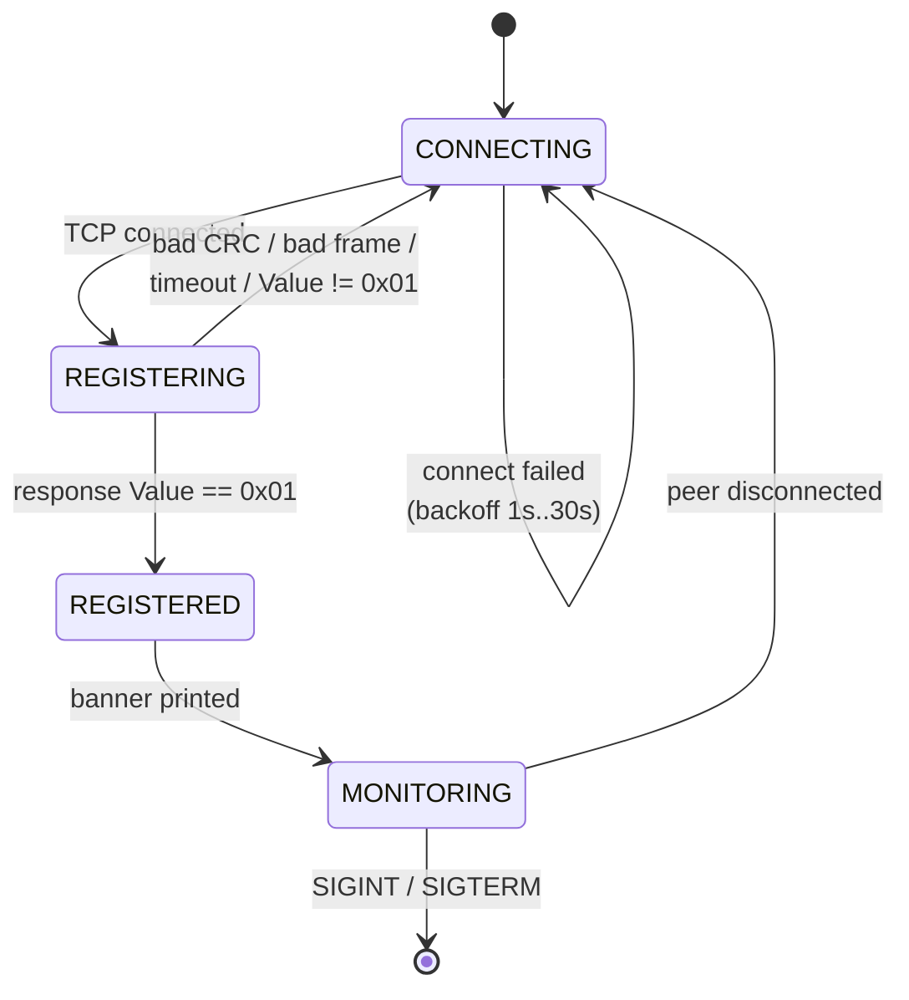
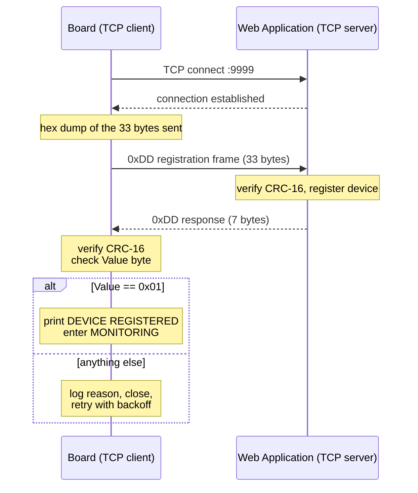

# ME Primary Board — Communication Module
## Functional / Workflow Diagram

> Milestone: device registration over TCP/IP with the Web Application.
> Target: Toradex Verdin iMX8M Plus (Cortex-A53, aarch64) running Torizon OS.

This document is written to be read top-to-bottom by any embedded developer.
Diagrams are given in plain ASCII first, so nothing needs rendering.

---

## 1. System context

The board is the **TCP client**. The Web Application is the **TCP server**.
This is the opposite of the usual "embedded device is a server" arrangement, so
it is worth fixing in mind early: nothing happens until the board reaches out.

```
   VERDIN iMX8M PLUS  (Torizon OS)                    WEB APPLICATION
   +--------------------------------+                 +------------------+
   |                                |                 |                  |
   |   me_primary  (in Docker,      |   TCP  :9999    |  Command &       |
   |               --network host)  |<===============>|  Response server |
   |                                |   registration  |                  |
   |   +------------------------+   |   + responses   |                  |
   |   | communication thread   |   |                 |                  |
   |   |                        |   |   UDP  :10000   |  Live data       |
   |   |  owns all 3 sockets    |   |- - - - - - - - >|  listener        |
   |   |  multiplexed w/ poll() |   |   (idle here)   |                  |
   |   |                        |   |                 |                  |
   |   +------------------------+   |   UDP  :10001   |  Session store   |
   |                                |- - - - - - - - >|  listener        |
   |                                |   (idle here)   |                  |
   +--------------------------------+                 +------------------+

   ===>  active in this milestone
   - ->  socket created and held open, but carries no traffic yet
```

| Port | Protocol | Direction | Used now? |
|---|---|---|---|
| 9999 | TCP | board ⇄ server | **Yes** — registration |
| 10000 | UDP | board → server | Socket only (live data, later) |
| 10001 | UDP | board → server | Socket only (session store, later) |

---

## 2. Startup workflow

```
   POWER ON
      |
      v
  +-------------------------------------------------------------+
  |  main()                                                     |
  |   1. parse arguments  (--server is required)                |
  |   2. install SIGINT / SIGTERM handlers                      |
  +-------------------------------------------------------------+
      |
      v
  +-------------------------------------------------------------+
  |  SYSTEM INITIALIZATION MODULE      (sys_init.c)             |
  |                                                             |
  |   1. read this board's own IP + MAC from the network        |
  |      interface  ....................  platform/netinfo.c    |
  |   2. open UDP socket on port 10000 ..  net/udp_sock.c       |
  |   3. open UDP socket on port 10001 ..  net/udp_sock.c       |
  |   4. build the registration request from the values above   |
  |                                                             |
  |   (the TCP socket is NOT opened here - the comm thread      |
  |    owns it, because it must be able to reconnect)           |
  +-------------------------------------------------------------+
      |
      v
  +-------------------------------------------------------------+
  |  CREATE COMMUNICATION THREAD       (comm_thread.c)          |
  |   pthread_create()  ->  runs the state machine in section 4 |
  +-------------------------------------------------------------+
      |
      v
  main thread blocks in pthread_join() until the comm thread exits
      |
      v
  close all sockets, exit
```

**Why the IP and MAC are read at startup, not hardcoded:** they are *payload*
inside the registration frame. The Web Application uses them to reach back to
this board. See section 7 — this is the one place where the `docker run` command
line affects protocol correctness.

---

## 3. Module block diagram

```
                        +--------------------+
                        |      main.c        |   argument parsing,
                        |                    |   signal handling
                        +---------+----------+
                                  |
                  +---------------+---------------+
                  |                               |
        +---------v---------+          +----------v-----------+
        |   sys_init.c      |          |   comm_thread.c      |
        |  system init      |          |  ONE thread,         |
        |  module           |          |  state machine,      |
        |                   |          |  poll() over 3 fds   |
        +----+---------+----+          +---+--------------+---+
             |         |                   |              |
             |         |                   |              |
   +---------v--+  +---v------------+  +---v-----------+  |
   | platform/  |  |  net/          |  |  net/         |  |
   | netinfo.c  |  |  udp_sock.c    |  |  tcp_client.c |  |
   |            |  |                |  |               |  |
   | own IP+MAC |  | UDP 10000/1    |  | connect/send/ |  |
   |            |  |                |  | recv on 9999  |  |
   +------------+  +----------------+  +---------------+  |
                                                          |
                          +-------------------------------+
                          |
              +-----------v------------+
              |   proto/               |    PURE LOGIC - no sockets.
              |                        |    This is why the byte layout
              |   proto_defs.h  <----- |--- is unit-testable on a Windows
              |     every offset,      |    laptop with no board attached.
              |     size, port, ID     |
              |                        |
              |   reg_frame.c          |    pack request / parse response
              |   crc16.c              |    CRC-16/Modbus
              +------------------------+

              +------------------------+
              |   util/log.c           |    timestamped log + hex dump
              +------------------------+    (used by everything above)
```

**Key rule:** `proto/proto_defs.h` is the single source of truth for every
offset, size, port and identifier. No magic numbers for this protocol appear
anywhere else in the codebase.

---

## 4. Communication thread — state machine

```
              +-------------------------------------------+
              |                                           |
              v                                           |
      +---------------+                                   |
      |  CONNECTING   |   TCP connect to <server>:9999     |
      +-------+-------+                                    |
              |                                            |
      success |            failure -> wait (backoff) ------+
              v                                            |
      +---------------+                                    |
      |  REGISTERING  |   send 33-byte 0xDD frame          |
      |               |   wait for 7-byte response         |
      +-------+-------+                                    |
              |                                            |
   Value==0x01|            anything else -----------------+
              v                                            |
      +---------------+                                    |
      |  REGISTERED   |   print "DEVICE REGISTERED"        |
      +-------+-------+                                    |
              |                                            |
              v                                            |
      +---------------+                                    |
      |  MONITORING   |   poll() on TCP + UDP 10000/10001  |
      |               |                                    |
      +-------+-------+                                    |
              |                                            |
              +-- peer disconnected ----------------------+
              |
              +-- SIGINT / SIGTERM --> close sockets, exit
```

Retry backoff doubles from 1 s to a ceiling of 30 s, and resets to 1 s after a
successful registration. The program never exits merely because the Web
Application is not up yet.

Mermaid version of the same machine:



---

## 5. Frame formats

### 5.1 Registration request — 33 bytes, board → server

```
 offset  0     1     2     3     4     5 ................ 20
        +-----+-----+-----+-----+-----+---------------------+
        | DD  | 01  | 1C  | Dev | Ckt |   Device Name       |
        |start|query| len |  #  |  #  |   16 B, null-padded |
        +-----+-----+-----+-----+-----+---------------------+
              21 ........ 24   25 ............... 30   31   32
        +---------------------+---------------------+-----+-----+
        |     IP address      |     MAC address     |   CRC-16  |
        |       4 bytes       |       6 bytes       |  2 bytes  |
        +---------------------+---------------------+-----+-----+

        |<-- header 3 B -->|<------ payload 28 B ------>|<-CRC->|
                              (this is what "len" counts)
```

- **Length byte = 0x1C = 28** — counts DeviceID through the end of the MAC.
  `1 + 1 + 16 + 4 + 6 = 28`, and `3 + 28 + 2 = 33`. The code *computes* this
  from the field sizes rather than hardcoding it.
- **IP is dotted-quad order.** `192.168.0.14` → `C0 A8 00 0E`, not a
  little-endian `uint32`.
- **CRC-16/Modbus** — poly `0xA001`, init `0xFFFF`, over bytes 0–30.

### 5.2 Circuit number — the ME redefinition

The legacy BTS circuit number was a flat index. In ME it carries two fields:

```
    bit  7   6   5   4     3   2   1   0
       +---------------+---------------+
       |   Secondary   |    Channel    |
       |   (DC-DC bd)  |   on that     |
       |               |   secondary   |
       +---------------+---------------+

    0x11  ->  Secondary 1, Channel 1
    0x34  ->  Secondary 3, Channel 4
    0xFF  ->  Secondary 15, Channel 15
```

### 5.3 Registration response — 7 bytes, server → board

```
 offset  0     1     2     3     4     5     6
        +-----+-----+-----+-----+-----+-----+-----+
        | DD  | 01  | Dev | Ckt |Value|   CRC-16  |
        |start|query|echo |echo |     |  2 bytes  |
        +-----+-----+-----+-----+-----+-----+-----+

        Value:  0x01 = Registered      <-- the only one that counts
                0x00 = Failed
                0x02 = Already registered
```

- **Only `Value` decides registration.** The Device and Circuit bytes are echoes:
  a mismatch is logged as a warning but never blocks registration.
- CRC covers bytes 0–4. A CRC failure causes the frame to be **rejected** and
  registration retried.

---

## 6. Registration handshake

```
   BOARD (client)                              WEB APPLICATION (server)
        |                                                  |
        |------------- TCP SYN -> :9999 ------------------>|
        |<------------ connection established ------------ |
        |                                                  |
        |  [hex dump of all 33 bytes printed to console]   |
        |------------- 0xDD registration (33 B) ---------->|
        |                                                  | verify CRC
        |                                                  | store device
        |<------------ 0xDD response (7 B) ----------------|
        |                                                  |
        |  verify CRC -> check Value byte                  |
        |  Value == 0x01 ?                                 |
        |     yes -> print "DEVICE REGISTERED"             |
        |     no  -> log reason, close, retry w/ backoff   |
        |                                                  |
        |============= connection held open ==============>|
        |            (MONITORING - future traffic)         |
```



---

## 7. The one deployment detail that is protocol-critical

```
   WRONG                                    RIGHT
   docker run ... <image> /me_primary       docker run --network host ...

   +---------------------------+            +---------------------------+
   |  container                |            |  container                |
   |   eth0 = 172.17.0.4       |            |   eth0 = 192.168.0.14     |
   |   mac  = 02:42:ac:11:00:04|            |   mac  = <real Verdin MAC>|
   +---------------------------+            +---------------------------+
              |                                        |
              v                                        v
   Frame is well-formed, CRC valid,         Frame carries the board's
   server registers the device...           real address. Server can
   ...at an address that does not           reach back. Correct.
   exist on the network.
```

The program detects a `172.16–31.x.x` address and warns, but a warning is not a
fix. Always deploy with `--network host` — `deploy.ps1` does this automatically.

---

## 8. What is deliberately NOT here yet

| Area | Status |
|---|---|
| Configuration (`0xAA`), Program (`0xBB`), Control (`0xEE`), Calibration (`0xA0`) | Command groups defined in `proto_defs.h`, not implemented |
| Live data on UDP 10000 | Socket open, nothing sent |
| Session store on UDP 10001 | Socket open, nothing sent |
| Device discovery (UDP 10002/10003) | Not implemented |
| CAN to Secondary boards (IF-B) | Not implemented |
| Modbus (IF-D) | Not implemented |

The state machine and module boundaries are shaped so these slot in without
restructuring: new command groups become new files under `proto/`, and
`MONITORING` is where their inbound frames get dispatched.
