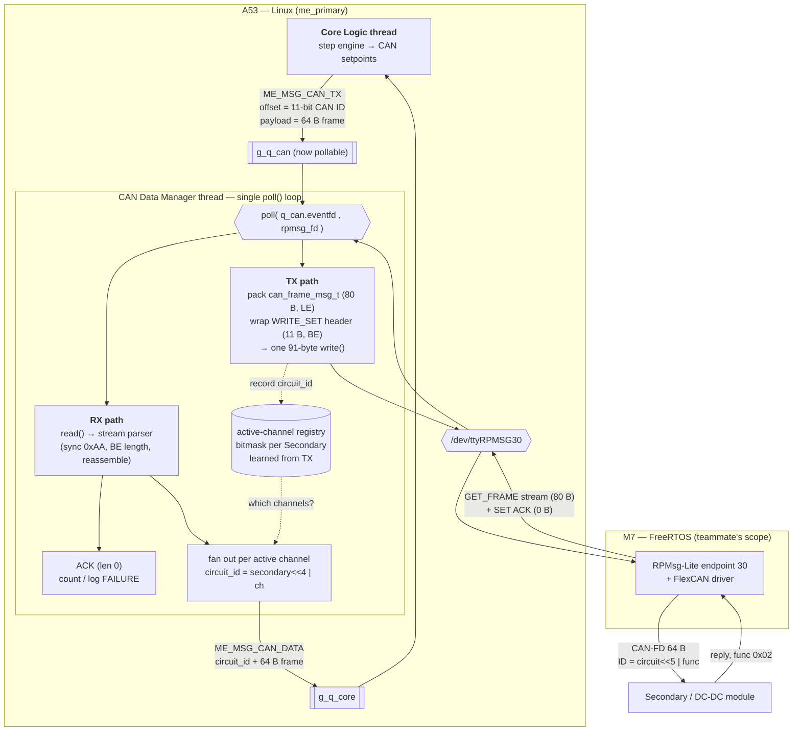
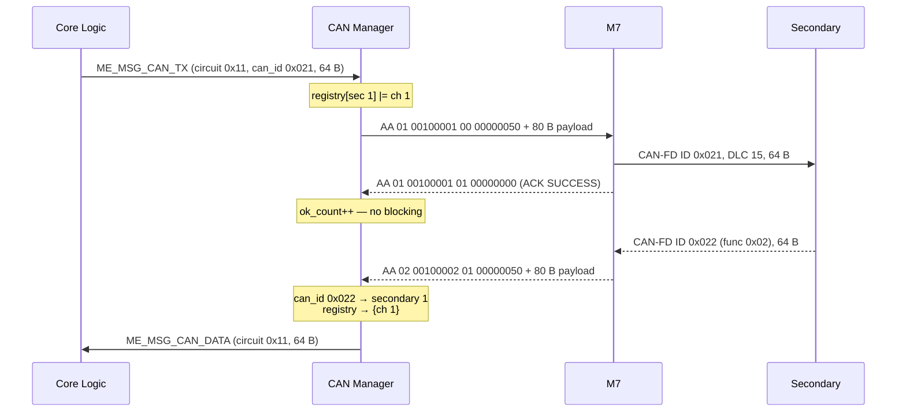

# RPMsg CAN Transport — A53 ↔ M7 (design)

| | |
|---|---|
| Date | 2026-08-18 |
| Status | Implemented (A53 side) — awaiting hardware-in-the-loop verification |
| Replaces | The CAN simulation in `src/threads/can_mgr.c` |
| Protocol source | `Ref Docs/RPMSG_PROTOCOL.md` v3.0 |
| CAN frame source | `Ref Docs/master_slave_can_v1.0.md` |

The CAN Data Manager stops fabricating Secondary responses and becomes a real
transport: it hands CAN-FD frames to the M7 over `/dev/ttyRPMSG30` and feeds the
M7's streamed replies back to Core Logic. The M7 side is owned by another
developer and is out of scope here.

**Nothing outside `can_mgr` changes shape.** Core Logic still sends
`ME_MSG_CAN_TX` with the CAN ID in `offset`, and still receives
`ME_MSG_CAN_DATA` carrying a 64-byte frame plus a `circuit_id`. Only the middle
is replaced.

---

## 1. Functional block diagram

## 2. Message flow, end to end

---

## 3. Wire encoding

Two nested layers, **opposite endianness** — the single easiest thing to get
wrong:

| Layer | Bytes | Endianness |
|---|---|---|
| RPMsg header | 11 | **big**-endian (`command`, `length`) |
| `can_frame_msg_t` | 80 | **little**-endian (`timestamp_ms`, `can_id`) |
| CAN payload floats | inside the 64 B | little-endian (already handled by `can_frame.c`) |

Outbound SET, per frame:

| Field | Value |
|---|---|
| `action` | `0x01` WRITE_SET |
| `command` | `0x00100001` CAN_SET_FRAME |
| `result` | `0x00` REQUEST |
| `length` | `80` |
| `can_id` | `m->offset` (11-bit, from Core Logic) |
| `is_extended` | `0` (standard ID) |
| `is_fd` / `brs` | `1` / `1` |
| `dlc` / `data_len` | `15` / `64` |
| `data[64]` | `m->payload` verbatim |

## 4. New and changed files

| File | Build | Purpose |
|---|---|---|
| `src/proto/rpmsg_frame.h/.c` | **both** | PURE: header wrap/unwrap, `can_frame_msg_t` pack/parse, DLC table, stream parser. No I/O. |
| `src/platform/rpmsg_link.h/.c` | cross only | `open()` + `cfmakeraw()` + `write_all()` + `close()` on the char device. |
| `src/threads/can_mgr.c` | cross only | Rewritten: poll loop, TX, RX, registry. Simulation deleted. |
| `src/app_queues.c` | both | One line: `g_q_can` becomes pollable. |
| `tests/test_rpmsg_frame.c` | native | Host tests (§6). |

`rpmsg_frame.c` lives under `proto/` for the same reason `can_frame.c` does:
it is pure byte layout, so the host build tests it without a board. All I/O is
quarantined in `platform/rpmsg_link.c`.

## 5. Behaviour decisions (developer-confirmed, 2026-08-18)

1. **Single thread, `poll()` on both sources.** `g_q_can` gains an eventfd, the
   thread polls `[queue, rpmsg_fd]`. One owner of the fd; ACKs and streamed
   frames are handled in the same parse loop. Mirrors `comm_thread`.
2. **ACKs are asynchronous.** A SET is written and the thread moves on.
   `SUCCESS` increments a counter; `FAILURE` logs a warning. Blocking on a
   round trip per frame would not fit the 1 ms cycle at 8 Secondaries.
3. **Inbound frames fan out over channels learned from TX.** `can_id >> 5`
   gives the Secondary; the registry gives which of its channels are live. This
   iteration has only channel 1, so exactly one `ME_MSG_CAN_DATA` is emitted —
   identical to today's behaviour, but it scales to 8 channels unchanged.
4. **A missing device degrades, it does not abort.** If `/dev/ttyRPMSG30` cannot
   be opened, the thread logs an error, keeps draining `g_q_can`, and counts
   every dropped TX. Registration and WebApp traffic stay up so the board is
   still diagnosable.

## 6. Testing

Host tests (`build-native.ps1`), all against `rpmsg_frame.c`:

- **Golden vector** — the exact 91 bytes from `RPMSG_PROTOCOL.md` §8 step 3
  (Classic CAN, ID `0x18F`, 8 data bytes). One byte wrong anywhere fails this.
- **Field offsets** — `can_frame_msg_t` is exactly 80 bytes; each offset from §3
  asserted individually, per the project's protocol-test standard.
- **Endianness** — `can_id 0x18F` encodes `8F 01 00 00`; `length 80` encodes
  `00 00 00 50`.
- **DLC table** — both directions, including the padded lengths (12/16/20/24/
  32/48/64) and the classic-CAN 8-byte ceiling.
- **Stream parser** — a frame split across two `read()`s; two frames in one
  read; leading garbage before `0xAA`; a `length > 80` skipping one byte and
  rescanning; a zero-length ACK.
- **Round trip** — pack then parse recovers every field.

The rewritten `can_mgr.c` is Linux-only and is covered by `build.ps1`
(`-Werror`) plus hardware-in-the-loop. **Compiling clean is not a test.**

## 7. Open questions

1. **Bit rate.** `RPMSG_PROTOCOL.md` §3 states 500 kbps nominal / 5 Mbps FD data
   phase with BRS. `Docs/CAN_FD_Transport_Analysis.md` was built on a flat
   2 Mbps figure. The M7 setting wins in practice — the analysis timings need
   recomputing against it, separately from this work.
2. **Block 1 / Block 2 ambiguity.** Channels 1–4 and 5–8 are two different
   64-byte block frames that share one CAN ID (`master_slave_can_v1.0.md`
   §"CANID cell"). With channels from both blocks active on one Secondary, an
   inbound frame cannot be attributed by ID alone. Not reachable this iteration
   (channel 1 only); `can_mgr` will log a warning if it ever becomes reachable.
3. **Device path.** Default `/dev/ttyRPMSG30`, overridable by the `ME_RPMSG_DEV`
   environment variable. Confirm whether a `deploy.ps1` parameter is wanted too.
4. **Retry / offline detection.** `master_slave_can_v1.0.md` specifies 3 retries
   then mark the Secondary offline. Not in this change — it belongs to Core
   Logic's step engine, which owns the poll cycle. Flagged so it is not lost.

## 8. Hardware-in-the-loop verification

Compiling clean proves nothing about this feature. The procedure:

1. Confirm the M7 is running: `cat /sys/class/remoteproc/remoteproc0/state`
   must print `running`.
2. Confirm the device exists: `ls -l /dev/ttyRPMSG30`.
3. Run the teammate's `rpmsg_can_test.py` first, standalone. If its
   `ACK SET_FRAME SUCCESS` does not appear, the fault is below this
   application and no amount of A53 debugging will help.
4. Deploy with `deploy.ps1` and watch for `rpmsg: opened /dev/ttyRPMSG30`.
5. Start a program on circuit 0x11 and confirm at shutdown that the CAN
   manager reports non-zero `tx` and `ack ok`, and zero `ack fail`.
6. With a Secondary connected, confirm non-zero `rx` and zero `unmatched`.
   Non-zero `unmatched` means a node is replying that we never addressed.
7. To see every byte, set `ME_RPMSG_DEBUG_LOG` to 1 in `can_mgr.c` and
   rebuild. Leave it at 0 for normal runs.

Requires hardware-in-the-loop testing to verify. This suggestion cannot be
validated on the development laptop.
