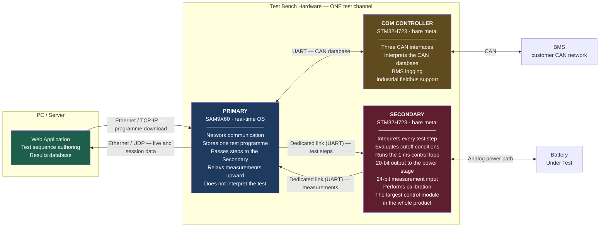
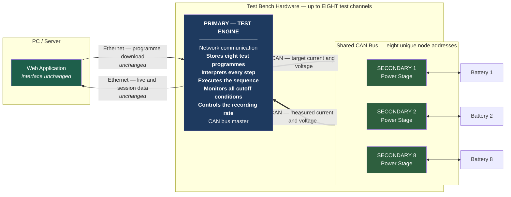
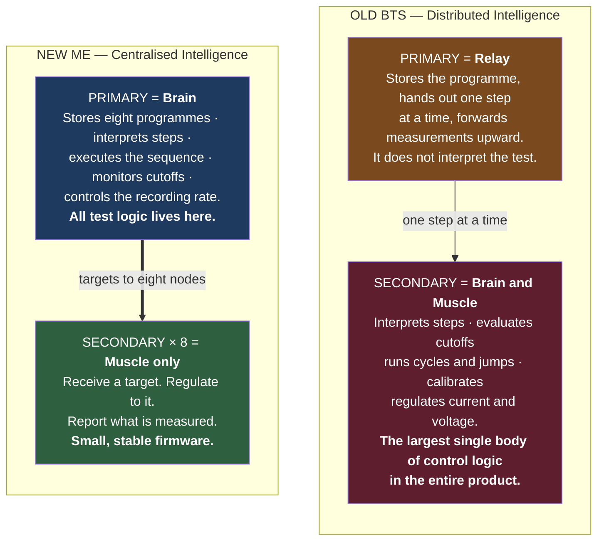
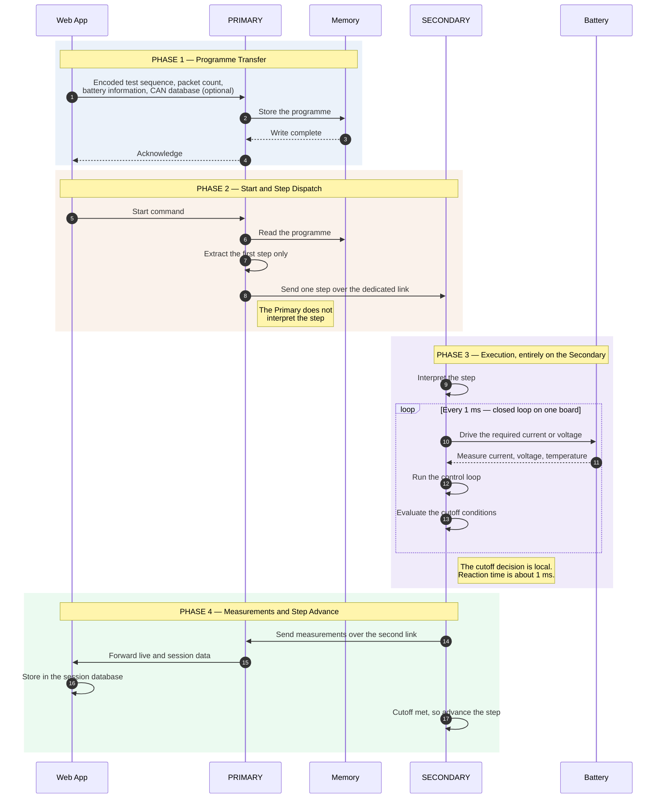
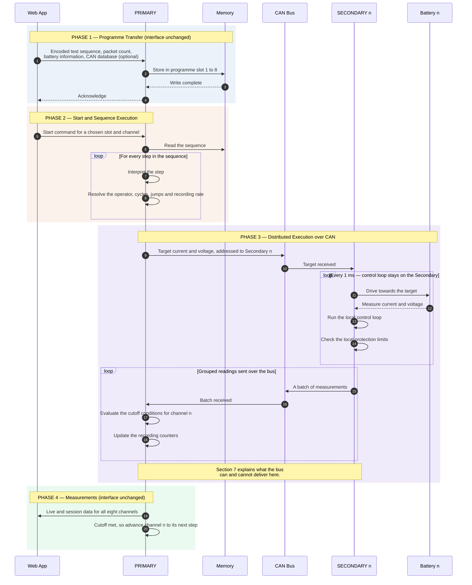
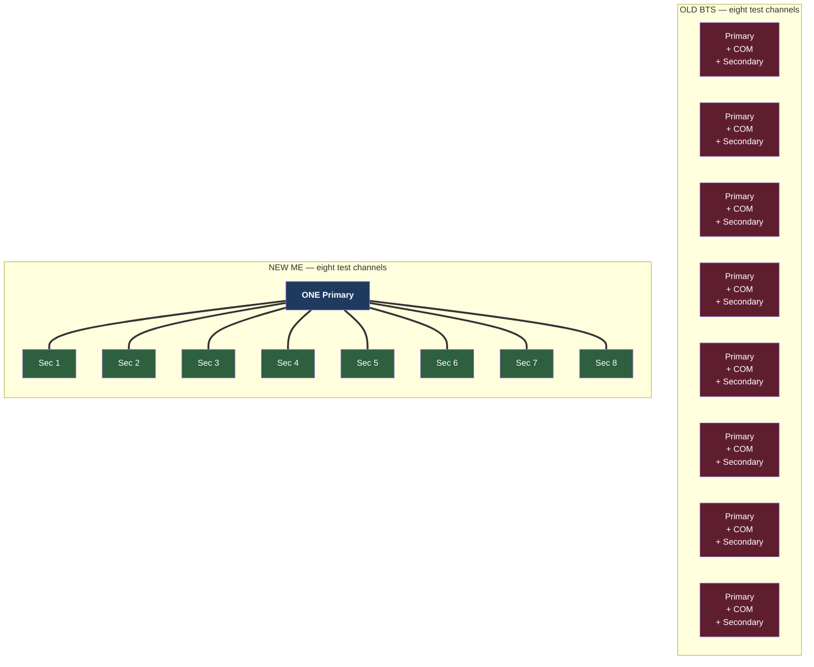
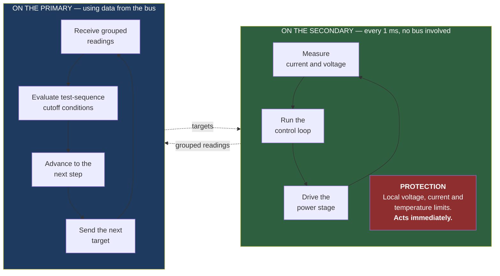

# Battery Testing System — Architecture and Functional Comparison
## Current Production Platform ("OLD BTS") vs. Proposed Platform ("ME")

| | |
|---|---|
| **Document ID** | BTS-CMP-ME-001 |
| **Version** | 3.0 |
| **Date** | 2026-07-31 |
| **Audience** | Senior Management / Technical Steering |
| **Status** | For Review |
| **Prepared by** | Firmware Engineering |
| **Bus analysis basis** | *Technical Brief: CAN Bus Feasibility Analysis for 8-Node Sensor Network* |

---

## How to read this document

Statements about the **OLD BTS** platform describe the product as it is built and shipping today. Statements about the **NEW ME** platform describe the proposed design; there is no hardware or firmware for it yet, so these are requirements rather than measurements.

| Marker | Meaning |
|---|---|
| **Today** | How the shipping product behaves |
| **Proposed** | A stated requirement of the ME design |
| **Estimate** | Our engineering analysis; requires confirmation before commitment |
| **Decision needed** | Requires a management or architecture decision before work starts |

**On the bus analysis.** Section 7 adopts the figures from our internal *CAN Bus Feasibility Analysis* brief: eight nodes, an 8-byte payload every 1 ms, a frame footprint of about 125 bits including protocol overhead and bit stuffing, and a target bus utilisation below 70 % for stability. Section 7.5 extends that brief with one refinement on how CAN FD should be applied; the brief's conclusion is unchanged.

---

# 1. Executive Summary

## 1.1 The change in one sentence

> The ME platform moves **all test-sequence intelligence from the Secondary board up to the Primary board**, and replaces the **point-to-point wired links with a shared CAN bus** — turning a one-channel-per-Primary product into an eight-channel-per-Primary product.

## 1.2 The three changes that matter

| # | Change | Business consequence |
|---|---|---|
| **1** | **Channel density rises from 1 to 8 per Primary.** Today the Primary controls exactly one test channel. The ME design places up to eight Secondaries on one CAN bus. | Roughly an eight-fold reduction in controller cost per test channel. This is the largest commercial driver. |
| **2** | **Intelligence is centralised on the Primary.** Today the Secondary interprets the test programme, evaluates cutoff conditions and runs the control loop. In ME the Secondary becomes a current and voltage power stage. | Test logic lives in one place. New operators, new cutoff types and corrections ship as a Primary release, without touching the Secondaries already installed. |
| **3** | **Communication moves from dedicated links to a shared bus.** Today each Secondary has two dedicated wired links to its Primary. In ME up to eight Secondaries share a single CAN bus. | Wiring and connector counts fall sharply. In exchange, bus capacity becomes a shared and finite budget that must be designed deliberately. |

## 1.3 The central technical question

The ME design requires each Secondary to report live current and voltage **every millisecond**, and that data must be stored. With eight Secondaries each sending 8 bytes, this is the single most demanding requirement in the proposal, and it drives almost every design decision that follows.

The arithmetic is stark and easy to state. Eight nodes reporting every millisecond produce **8,000 messages per second**. At roughly 125 bits per message, that is **exactly 1 Mbit/s of measurement traffic** — the entire maximum capacity of a standard CAN bus, with nothing left over for anything else.

Our analysis (Section 7), which follows our internal *CAN Bus Feasibility Analysis* brief, reaches four conclusions:

1. **Standard CAN cannot carry this traffic at any speed.** The load is 400 % at 250 kbit/s, 200 % at 500 kbit/s, and 100 % or more even at 1 Mbit/s, which is the fastest standard CAN can run.
2. **There are two distinct failure modes, not one.** Beyond simple saturation, if all eight timers expire in the same millisecond the resulting burst takes the entire 1 ms window to clear. The lowest-priority Secondary is then perpetually late and misses its next window — every cycle. One test channel would silently report less data than the other seven.
3. **CAN FD solves it, and grouping the readings solves it comfortably.** Sending eight readings in one larger message instead of one reading per message brings the bus load to about 30 % at the lower and cheaper data rate, and removes the burst problem as well. No data is lost.
4. **Receiving all the data is not the same as receiving it immediately.** Grouped readings arrive in batches, so the newest reading in a batch is already several milliseconds old. Data storage and protective reaction are therefore two separate problems needing two separate solutions.

## 1.4 Our recommendation

**Proceed with the ME architecture.** The gains in channel density and maintainability are structural rather than marginal. Proceed subject to three conditions:

- **Condition A — Keep the control loop on the Secondary.** The loop that regulates current and voltage runs every millisecond. It must stay on the Secondary board, where the measurement and the output sit together. It cannot run across a shared bus.
- **Condition B — Keep protection on the Secondary.** Each Secondary must continue to enforce its own voltage, current and temperature limits locally, acting immediately and independently of the bus. The Primary's cutoff monitoring then handles test-sequence logic, not protection.
- **Condition C — Specify CAN FD, not standard CAN, and group the readings.** The stated 1 ms reporting requirement cannot be met with standard CAN at any speed. This must be settled **before hardware design begins**, because it determines controller and transceiver selection. If Product Management concludes that 2 ms resolution is genuinely sufficient, standard 1 Mbit/s CAN becomes viable at about 50 % load — but that is a decision to take deliberately, not a default to fall into.

With these three conditions the design is sound. Without them, ME would be slower to react to a fault than the product we ship today, and one of its eight channels would silently record less data than the rest.

---

# 2. Platform Architecture

## 2.1 OLD BTS — as built today

An important clarification: the current platform consists of **three** boards, not two.

**Key characteristics of the current platform**

| Characteristic | Today |
|---|---|
| Test channels per Primary | Exactly one |
| Test programmes stored | Exactly one |
| Board types in a bench | Three |
| Primary to Secondary links | Two dedicated UART links, one in each direction |
| Primary to COM controller link | UART, carrying the CAN database |
| PC to Primary links | Ethernet — TCP/IP for the programme download, UDP for live and session data |
| Where the test programme is interpreted | On the Secondary |
| Where cutoff conditions are evaluated | On the Secondary, every 1 ms |
| Where the control loop runs | On the Secondary, every 1 ms |
| CAN interfaces | On the COM controller only. The Secondary has none. |

## 2.2 NEW ME — as proposed

## 2.3 The most important difference — where the intelligence sits

**Why this matters commercially.** Today, adding a new test operator or a new cutoff type means changing the Secondary firmware, re-qualifying it, and re-programming every Secondary already installed at customer sites. Under the ME design the same change becomes a Primary release: one board, one release, one qualification cycle. Once the Secondary firmware is correct, it stops changing.

---

# 3. Execution Flow — OLD BTS

**What characterises this design.** During a running test the Primary acts mainly as a message carrier. The complete cycle of measure, decide and act takes place inside a single microcontroller in about one millisecond. This is why the current product reacts quickly, and it is also why it cannot serve more than one channel.

---

# 4. Execution Flow — NEW ME

**What characterises this design.** The Primary runs eight independent sequence engines at the same time. The fast regulation loop stays on each Secondary, while the supervisory work — cutoff evaluation, step advance and recording — runs on the Primary at the rate the bus can sustain. This two-level structure is the correct design, and Section 7 explains why it is also the only workable one.

---

# 5. Functional Comparison

Each row below maps to one of the numbered requirements provided.

## 5.1 Programme authoring and transfer — unchanged by design

| # | Function | OLD BTS | NEW ME | Change |
|---|---|---|---|---|
| 1 | Sequence authoring | PC web application | PC web application | None |
| 2 | PC to Primary connection | Ethernet | Ethernet | None |
| 3 | Sequence transfer | Encoded, over the network | Encoded, over the network | None |
| 4 | Additional data sent with the transfer | Packet count, battery information, optional CAN database | Packet count, battery information, optional CAN database | None |

> **Why this matters.** The whole PC application and its communication protocol are preserved. ME is a firmware and hardware-topology change, not a rewrite of the web application. This protects the existing investment in the application, its session databases and its reporting, and it removes a large amount of schedule risk.

## 5.2 Storage

| # | Function | OLD BTS | NEW ME | Impact |
|---|---|---|---|---|
| 5 | Storage medium | 4 MB serial memory device | Non-volatile memory, device to be selected | Decision needed |
| 5 | Programme capacity | One sequence | Eight sequences | Eight-fold increase |
| 11 | Slot addressing | A single fixed location; no concept of a slot exists | Eight addressable slots | A new memory layout is required |

**Sizing analysis — Estimate.** The current design reserves up to 1 MB for a single test programme, on a memory device of 4 MB in total. Eight slots at that same worst-case size would need 8 MB, which is more than the entire existing device. There are two ways forward: fit a larger memory device, or set a maximum size per programme. We recommend measuring the size of real customer test programmes before choosing, rather than providing for a theoretical maximum that may never occur in practice.

## 5.3 Execution — the core architectural change

| # | Function | OLD BTS | NEW ME | Impact |
|---|---|---|---|---|
| 6 | Step interpretation | Secondary | **Primary** | Ownership moves up |
| 6 | Sequence execution | Secondary | **Primary** | Ownership moves up |
| 6 | Step dispatch model | The Primary sends a raw step; the Secondary interprets it | The Primary interprets the step and sends only the resolved targets | The Secondary no longer parses the test protocol |
| 9 | Cutoff monitoring | Secondary, locally, about every 1 ms | **Primary**, using data received over the bus | Reaction time increases — see Section 8 |
| 9 | Recording rate control | Secondary | **Primary** | Ownership moves up |
| 8 | Secondary responsibility | A complete test engine: step interpretation, cutoffs, cycles, jumps, calibration and regulation | Regulate to a received target and report measurements | Scope greatly reduced |
| — | Regulation loop | Runs every 1 ms on the Secondary | **Must remain every 1 ms on the Secondary** (Condition A) | Must not be moved across the bus |

## 5.4 Communication and measurement reporting

| # | Function | OLD BTS | NEW ME | Impact |
|---|---|---|---|---|
| 7 | Primary to Secondary | A dedicated wired link, one Secondary per link | CAN, shared by up to eight nodes | Topology change |
| 9 | Secondary to Primary | A second dedicated wired link | The same shared CAN bus | Capacity is now shared |
| 7 | Message content | The complete encoded step | Only the essential values: target current and voltage | Greatly simplified |
| 10 | Node addressing | Implicit, because there is only one Secondary per link | An explicit CAN address per node, eight in total | A new addressing scheme is required |
| 12 | Primary to Web Application | Live and session data over the network | Unchanged | No protocol change, but eight times the volume |

## 5.5 Scale

| # | Dimension | OLD BTS | NEW ME | Factor |
|---|---|---|---|---|
| 10 | Secondaries per Primary | 1 | 8 | Eight-fold |
| 11 | Stored sequences | 1 | 8 | Eight-fold |
| — | Concurrent test channels | 1 | 8 | Eight-fold |
| — | Board types in a bench | 3 | 2 | One fewer type |
| — | Primary boards needed for eight channels | 8 | 1 | A reduction of 87.5 % |

---

# 6. Scaling Economics

**Controller-side count for one eight-channel bench** — *Estimate. Board counts are structural; unit costs require confirmation by Purchasing.*

| Item | OLD BTS | NEW ME | Change |
|---|---|---|---|
| Primary boards | 8 | 1 | −7 |
| COM controller boards | 8 | 0 or 1 | −7 or −8 |
| Secondary power-stage boards | 8 | 8 | No change |
| Ethernet ports used | 8 | 1 | −7 |
| Network addresses to manage | 8 | 1 | −7 |
| Inter-board cable runs | 24 | 1 shared bus | A large reduction |

The Secondary power stage count does not change, because one power stage is inherently required per battery. The entire saving lies in the controller and network layer, which is precisely where the current design is over-provisioned: today every individual battery is given its own controller board, its own network stack and its own address on the customer's network.

---

# 7. The 1 ms Live Data Requirement

**This is the most important technical section in this document.** The ME design requires each Secondary to report live current and voltage every millisecond, and that data must be stored. This section explains, in plain terms, what that asks of the CAN bus and whether the bus can deliver it.

The figures below are those of our internal *CAN Bus Feasibility Analysis* brief. Its conclusion and this document's conclusion are the same: **the proposed architecture is not viable on standard CAN, and CAN FD is required.**

## 7.1 What is being asked

| What we need | Number |
|---|---|
| Number of Secondaries on the bus | 8 |
| How often each Secondary reports | Every 1 ms, which is 1,000 times per second |
| Size of each reading | 8 bytes — the maximum a standard CAN message can carry |
| **Total messages the bus must carry, every second** | **8,000** |
| Size of one message including protocol overhead and bit stuffing | About 125 bits |
| **Total data rate the requirement demands** | **8,000 × 125 = 1,000,000 bits per second, or exactly 1 Mbit/s** |

The last line is the key number in this whole document. **The requirement demands exactly one megabit per second of pure measurement traffic** — which happens to be the entire maximum capacity of a standard CAN bus, leaving nothing whatsoever for anything else.

## 7.2 What the bus can actually carry

A CAN bus is a single shared wire. Only one message can travel on it at a time, and every message must finish before the next one starts.

For a network to remain stable, total utilisation should stay **below 70 %**. Above 100 %, the bus physically cannot move the bits fast enough to keep up with the data being produced.

| Bus speed | Capacity | Load imposed by the requirement | Verdict |
|---|---|---|---|
| 250 kbit/s | 250,000 bits/s | **400 %** | Fails — total overload |
| 500 kbit/s | 500,000 bits/s | **200 %** | Fails — total overload |
| 1 Mbit/s (the maximum for standard CAN) | 1,000,000 bits/s | **100 % to 108 %** | Fails — total saturation, zero margin |

**Conclusion: standard CAN cannot meet this requirement at any speed.** This is not a matter of tuning or optimisation. Even at its maximum speed, the requirement consumes the entire bus.

### A simpler way to picture it

Think of the CAN bus as a single-lane road with one toll booth. Every message must pass through one at a time.

At 500 kbit/s, one message takes **0.25 ms** to pass through.

- In each 1 ms window, the booth can process **exactly four messages**.
- But **eight** Secondaries each want to send a message in that same window.
- Four get through. The other four are still waiting when the next millisecond's eight messages arrive.
- The queue grows by four messages every millisecond, and it never recovers.

The delay grows without limit until the message buffers fill and readings are lost. The bus does not simply run slowly — it fails.

## 7.3 There are two separate ways the bus fails

It is worth understanding both, because they need different reasoning.

### Failure 1 — Total saturation

The bus simply cannot carry 8,000 messages per second. As the table above shows, even a 1 Mbit/s bus is at 100 % or beyond. Nodes continuously lose arbitration, transmit queues overflow, and the Primary suffers heavy data loss.

### Failure 2 — Burst congestion

This second failure is more subtle, and it bites even in the most optimistic case.

All eight Secondaries run their own 1 ms timers. Sooner or later those timers expire in the same millisecond, and all eight try to transmit at once. On a 1 Mbit/s bus, clearing eight 8-byte messages one after another takes:

> 8 messages × 125 bits = 1,000 bits, which at 1 Mbit/s takes **1,000 microseconds — exactly 1.0 ms**

The burst therefore consumes **the entire 1 ms cycle window**. There is no time left before the next round of readings is produced. Because CAN resolves collisions strictly by priority, the same lowest-priority Secondary loses every time. It is perpetually late, and it misses its next transmit window entirely — every cycle, indefinitely.

**Why this matters for us specifically:** the lowest-priority node would be a real test channel with a real customer battery on it. It would silently report less data than the other seven. That is a far more damaging failure than an even slowdown across all eight, because it is unfair and it is easy to miss during testing.

## 7.4 The two ways forward

Our feasibility brief identifies two architectural directions. Both work. They suit different priorities.

| | **Option 1 — Performance focused** | **Option 2 — Legacy hardware focused** |
|---|---|---|
| **What changes** | Specify CAN FD controllers and transceivers | Keep standard 1 Mbit/s CAN hardware, and either compress the readings or slow the reporting rate from 1 ms to 2 ms |
| **Reporting rate achieved** | The full 1 ms | 2 ms, which is 500 readings per second per Secondary |
| **Resulting bus load** | About 30 % | About 50 % |
| **Data delivered to the database** | Every 1 ms reading | Half as many readings |
| **Hardware cost** | Higher — new controllers and transceivers | Lower — existing component types are retained |
| **Suits you if** | The 1 ms reading genuinely matters to the customer | 2 ms resolution is sufficient in practice |

**Our recommendation is Option 1.** The 1 ms rate is a stated requirement of the design, and Option 2 meets it only by abandoning it. However, Option 2 is a legitimate fallback, and it is worth confirming with Product Management whether customers genuinely need 1 ms resolution before committing to the extra hardware cost. Section 9 asks a closely related question about storage.

## 7.5 One refinement on how CAN FD should be applied

CAN FD gives us two distinct advantages, and **how we use them changes the result significantly.**

1. It sends the data portion of a message **several times faster** — at 2 Mbit/s or 5 Mbit/s instead of 1 Mbit/s.
2. It carries up to **64 bytes** in one message, instead of 8.

The feasibility brief relies mainly on the first advantage. That works, but only at the higher data rate, because part of every message — the addressing and acknowledgement — must still travel at the slower rate, and that cost is paid 8,000 times per second regardless of how fast the data portion moves.

**Using the second advantage as well removes that limitation.** One 64-byte message holds **eight complete readings**. The Secondary measures every millisecond exactly as before, holds the readings briefly, then sends eight together. Nothing is lost — the database still receives one reading for every millisecond — but the bus now carries 1,000 messages per second instead of 8,000, so the fixed per-message cost is paid one eighth as often.

| Approach | Data-phase speed | Messages per second | Bus load | Verdict |
|---|---|---|---|---|
| Standard CAN | — | 8,000 | 200 % at 500 kbit/s, 100 %+ at 1 Mbit/s | Fails |
| CAN FD, one reading per message | 2 Mbit/s | 8,000 | About 60 % | Works, but close to the 70 % limit |
| CAN FD, one reading per message | 5 Mbit/s | 8,000 | About 38 % | Works |
| **CAN FD, eight readings per message** | **2 Mbit/s** | **1,000** | **About 30 %** | **Recommended** |
| CAN FD, eight readings per message | 5 Mbit/s | 1,000 | About 14 % | Works, with large margin |

**Why we recommend grouping the readings.** It reaches a comfortable bus load at the lower and cheaper 2 Mbit/s data rate, it leaves around 70 % of the bus free for target commands and urgent fault messages, and — most importantly — it also solves the burst congestion problem from Section 7.3. When each Secondary transmits once every 8 ms rather than eight times, the bus is idle most of the time and no node is perpetually starved.

## 7.6 The important limitation — complete is not the same as immediate

Grouping readings solves the storage problem completely. It does **not** make the Primary's reaction fast.

When eight readings arrive together every 8 ms, the newest reading in that group is already up to 8 ms old by the time the Primary sees it. The Primary receives every reading, but it receives them a little late.

This means the design must answer two separate questions with two separate solutions:

| Requirement | Answer |
|---|---|
| **Complete 1 ms data for the database** | Group the readings and send them over CAN FD. Fully solved. |
| **Immediate reaction to a dangerous condition** | Cannot travel over a shared bus. Must be decided on the Secondary itself. See Section 8. |

---

# 8. Cutoff Reaction Time

## 8.1 What a cutoff condition is

A cutoff condition is a rule that ends a test step — for example, *stop charging when the voltage reaches 4.2 V*. Some cutoffs are ordinary test logic. Others are protection, and they exist to prevent damage to the battery or the equipment.

## 8.2 How it works today

The Secondary measures the battery and checks the cutoff rules **on the same board, every millisecond**. Nothing travels over a communication link. If a limit is exceeded, the Secondary reduces the drive immediately.

## 8.3 What changes in ME

The ME design moves cutoff monitoring to the Primary. The Primary can only act on information that has reached it over the CAN bus. As Section 7 shows, that information arrives in groups roughly every 10 ms rather than continuously every millisecond.

| | Today | ME, if the Primary decided alone |
|---|---|---|
| How often the battery is measured | Every 1 ms | Every 1 ms |
| Where the decision is made | On the same board as the measurement | On the Primary, after the reading crosses the bus |
| Worst-case delay before the drive is reduced | About 1 ms | About 10 ms |

## 8.4 Why this matters

Consider a battery whose voltage is rising quickly towards the end of a charge step.

**For ordinary test logic, 10 ms is perfectly acceptable.** A step that should end at 4.2 V will still end at 4.2 V. Ending it nine milliseconds later makes no measurable difference to the test result or to the customer's report.

**For protection, 10 ms is not acceptable.** If a cell is failing or a connection has come loose, current can rise very quickly. Increasing the reaction time by a factor of ten would make ME slower to protect the battery than the product we ship today. That is a genuine reduction in safety, and it must not be accepted by default.

## 8.5 The solution — separate the two jobs

**1. Protection stays on the Secondary.** Each Secondary keeps its own voltage, current and temperature limits and enforces them locally every millisecond, exactly as it does today. This is not new development work — the capability already exists on the board and simply needs to be retained.

**2. Test logic moves to the Primary.** The Primary evaluates step-ending cutoffs, cycle counts and recording using the data it receives from the bus. A granularity of about ten milliseconds is entirely appropriate for this purpose.

**3. Urgent events are given priority on the bus.** CAN allows messages to be ranked, and a higher-ranked message always goes first. If a Secondary detects a dangerous condition, it sends an alert with the highest rank. That alert moves ahead of all routine measurement traffic and reaches the Primary in well under a millisecond, allowing the Primary to stop the other channels if required.

**The result.** ME matches the current product's protection speed, because protection never leaves the Secondary. At the same time it gains central control of the test sequence, which is the whole purpose of the change.

---

# 9. A Second Consequence — Data Volume

The 1 ms requirement is demanding not only for the bus but also for storage. This deserves a deliberate decision rather than an assumption.

| | Per channel | All eight channels |
|---|---|---|
| Readings per second | 1,000 | 8,000 |
| Readings per hour | 3.6 million | 28.8 million |
| Readings in an eight-hour test | 28.8 million | **230 million** |

**Estimate.** At roughly 40 bytes per stored reading, an eight-hour test across eight channels produces in the order of **9 GB** of measurement data. The existing web application already writes to a separate database per test session using a background queue, so the mechanism is in place — but it has never been asked to absorb eight channels at this rate.

**A question worth asking before committing.** Is a stored reading genuinely required for every single millisecond, or would 1 ms *measurement* combined with slower *storage* meet the real need? For example, the Secondary could measure every millisecond and store every tenth reading, together with the minimum and maximum values seen in between. That approach reduces stored volume by a factor of ten while preserving the extreme values, which are what matter for both cutoff analysis and customer reports.

This is a product decision rather than an engineering one, and it should be taken consciously. The answer changes the bus specification, the database sizing and the reporting design.

---

# 10. Qualitative Scorecard

Scored from 1 to 5, where 5 is best. These are **engineering judgements offered for discussion**, not measurements. Every score carries its justification.

| Dimension | OLD | NEW ME | Better | Justification |
|---|---:|---:|---|---|
| Channel density and cost per channel | 1 | 5 | **ME** | Eight channels per Primary instead of one. Seven fewer controller boards and network endpoints per eight channels. |
| Maintainability of test logic | 2 | 5 | **ME** | Today a change to the test logic must be re-qualified and re-programmed across every installed Secondary. ME makes it a Primary release. |
| Wiring and assembly complexity | 2 | 5 | **ME** | Twenty-four separate cable runs are replaced by one shared bus. |
| Board types to source and stock | 2 | 4 | **ME** | Three board types reduce to two. |
| Secondary firmware simplicity | 1 | 5 | **ME** | The Secondary loses step interpretation, cutoff logic and the cycle engine. Smaller firmware is easier to test and to trust. |
| Speed of adding new features | 2 | 5 | **ME** | New operators no longer require a Secondary release. |
| Regulation loop performance | 5 | 5 | Equal | Both keep the 1 ms loop on the Secondary, provided Condition A is honoured. |
| Protection reaction time | 5 | 5 | Equal | Equal **only if** Condition B is honoured. Without a local limit on the Secondary, ME would score 2. |
| Cutoff granularity for test logic | 5 | 3 | **OLD** | About 1 ms today, against about 10 ms across the bus. Acceptable for test logic, as explained in Section 8. |
| Fault isolation | 5 | 2 | **OLD** | Today one Primary fault stops one channel. Under ME it stops eight. |
| Communication capacity margin | 5 | 3 | **OLD** | Dedicated links cannot contend with one another. A shared bus can, and must be budgeted deliberately. |
| Primary processing headroom | 4 | 2 | **OLD** | One Primary must run eight sequence engines, eight cutoff evaluators and eight streams of measurement traffic. Requires a load study before commitment. |
| Storage capacity adequacy | 4 | 2 | **OLD** | Eight programme slots need more memory than the current device provides. |
| Ease of diagnosis on the wire | 3 | 4 | **ME** | CAN traffic can be observed with standard commercial tools. A proprietary link cannot. |
| Reuse of the existing PC application | 5 | 5 | Equal | The network interfaces are preserved, which removes considerable schedule risk. |
| Reuse of existing CAN experience | — | 4 | **ME** | The team already ships CAN and CAN-database handling on the COM controller. This is not a new competency. |

### Summary

| | OLD BTS | NEW ME |
|---|---:|---:|
| **Total across 16 dimensions** | **50** | **59** |
| Dimensions where it is stronger | 5 | 8 |
| Dimensions that are equal | 3 | 3 |

**How to read this fairly.** ME wins decisively on cost, scalability and maintainability — the dimensions that determine product economics. OLD BTS wins on fault isolation, communication margin and processing headroom — the dimensions that determine robustness. The ME design is therefore a favourable trade rather than a free upgrade, and the price of the trade is the specific engineering work listed in Section 11.

---

# 11. Risk Register

| ID | Risk | Severity | Consequence | Mitigation |
|---|---|---|---|---|
| **R1** | **Protection reaction time could degrade** from about 1 ms to about 10 ms if cutoff decisions were moved entirely to the Primary | **High — safety** | ME would protect the battery more slowly than the product we ship today | **Condition B.** Keep independent local limits on every Secondary. The capability already exists and needs only to be retained. Verify on real hardware before release. |
| **R2** | **A single Primary fault now affects eight channels** instead of one | **High** | Eight batteries could be left in an undefined state by one failure | Each Secondary must fail safe when the bus goes quiet: if no message is received within a set time, ramp the drive to zero. Add watchdog coverage on both boards. Resolve the known memory-write fault on the Primary before it serves eight channels. |
| **R3** | **Standard CAN cannot meet the 1 ms reporting requirement.** The load is 200 % at 500 kbit/s and 100 % or more even at 1 Mbit/s | **High** | The core requirement of the design would not be achievable | **Condition C.** Specify CAN FD and group the readings from the outset. Settle before hardware design begins, because it determines component selection. Alternatively confirm that 2 ms resolution is acceptable, which makes standard 1 Mbit/s CAN viable at about 50 % load. |
| **R3a** | **Burst congestion starves the lowest-priority node.** If all eight timers expire in the same millisecond, the burst takes the entire 1 ms window to clear | **High** | One test channel would silently record less data than the other seven — an unfair failure that is easy to miss in testing | Group the readings so each Secondary transmits once every 8 ms rather than eight times, leaving the bus idle most of the time. Additionally, stagger the Secondaries' transmit timers by a fixed offset per node so their bursts do not coincide. Verify by measuring per-channel message loss on real hardware. |
| **R4** | **Bus capacity could still be exhausted** if message rates grow during development | Medium | Lost readings and uneven cutoff timing | Produce a formal capacity budget at design freeze, targeting utilisation below 70 %. Rank safety and fault messages above routine traffic. Measure actual bus load in firmware and report it. |
| **R5** | **The Primary may not have enough processing capacity** for eight sequence engines | Medium | Late discovery would force a redesign or a change of processor | Carry out a load study before design freeze: build eight concurrent sequence engines with eight cutoff evaluators and eight measurement streams, then measure. |
| **R6** | **Storage memory may be undersized** for eight programmes | Medium | Eight full-size sequences could not be stored | Measure the size of real customer programmes, then either set a size limit per slot or specify a larger device. Decide before board layout. |
| **R7** | **The CAN hardware route on the Primary is not yet decided** | Medium | Schematic work cannot begin | Choose between the CAN interfaces already present in the Primary processor and repurposing the existing COM controller. See Section 12. |
| **R8** | **The BMS CAN logging feature could be lost** if the COM controller is removed | Medium | An existing customer feature would regress | If the COM controller is removed, its CAN-database handling must be re-homed. The test bus and the customer's BMS bus should remain physically separate in all cases. |
| **R9** | **Database volume grows eightfold**, and considerably more if every millisecond is stored | Medium | Slow reports, large disk consumption, possible data loss under load | Decide the storage policy consciously (Section 9). Load-test the application at eight channels before release. |
| **R10** | **Moving the test logic could introduce errors** | Medium | The mature and well-proven Secondary test engine must be reproduced exactly on the Primary | Port the existing logic rather than rewriting it. Build a comparison harness that runs identical sequences on both platforms and checks that the results match step by step. |

---

# 12. Open Decisions

## 12.1 Where should CAN sit on the Primary?

| Option | Description | Advantages | Disadvantages |
|---|---|---|---|
| **A** | Use the CAN interfaces already built into the Primary processor | The silicon capability is already present. The COM controller can be removed entirely, giving the lowest material cost. | The driver software is new work. The board needs pin routing and a transceiver added. |
| **B** | Repurpose the existing COM controller as a CAN gateway | Its CAN interfaces and database handling already work and are proven in the field. | A third board type is retained. It also adds an extra hop, which lengthens the path that measurements must travel. |
| **C** | Use the Primary's CAN for the test bus and keep the COM controller for the customer's BMS bus | Cleanly separates the safety-relevant test bus from the customer's BMS network. | Two board types are retained, giving the highest material cost of the three. |

**Our recommendation.** Use **Option A** for the test bus, and retain the COM controller only on product variants that require BMS logging. In effect this is Option C offered as a paid option rather than as standard fitment. It keeps the safety-relevant test bus on the shortest possible path while preserving the logging feature for customers who buy it.

## 12.2 Other decisions required

| # | Decision | Owner | Why it must be settled first |
|---|---|---|---|
| D2 | **CAN FD at the full 1 ms rate, or standard CAN at a reduced 2 ms rate** | Product Management, with Firmware and Hardware | This is the decision on the critical path. It selects the controller and transceiver, and it cannot be reversed cheaply after hardware design. See Section 7.4. |
| D3 | **Is a stored reading required for every millisecond?** | Product Management | Closely linked to D2. Determines the bus specification, the database sizing and the reporting design (Section 9). If 2 ms is acceptable for storage, it is likely acceptable for the bus too. |
| D3a | **How should the eight Secondaries' transmit timers be staggered?** | Firmware | Prevents all eight bursting in the same millisecond (Section 7.3). Cheap to design in now, awkward to retrofit. |
| D4 | **Maximum acceptable reaction time for protection** | Product and Safety | Confirms whether local limits on the Secondary are mandatory. We believe they are. |
| D5 | **Storage device and maximum programme size** | Hardware and Firmware | Blocks the memory layout and the board layout. |
| D6 | **Is ME a new product line or an upgrade for installed systems?** | Product Management | Existing Secondaries have no CAN interface, so an upgrade would require hardware rework. |
| D7 | **Does the BMS CAN logging feature carry forward?** | Product Management | Determines whether the COM controller board survives. |
| D8 | **Must all eight channels run different sequences at the same time?** | Product Management | Has a large effect on the processing capacity the Primary requires. |

---

# 13. Conclusion

| Question | Answer |
|---|---|
| **Is the ME architecture the right direction?** | **Yes.** Centralising the test intelligence and moving to a shared bus converts a one-channel-per-controller product into an eight-channel-per-controller product. That is a structural improvement in unit economics and in maintainability, not an incremental one. |
| **Can the 1 ms live data requirement be met?** | **Yes, but only with CAN FD.** Eight nodes reporting 8 bytes every millisecond demand exactly 1 Mbit/s — the entire capacity of a standard CAN bus. Standard CAN therefore fails at any speed. With CAN FD and grouped readings, every millisecond reading reaches the database and the bus runs at about 30 % of capacity. |
| **Is the change free?** | **No.** It reduces fault isolation, because one Primary fault now affects eight channels instead of one, and it makes the shared bus a resource that must be budgeted. These are real costs against the shipping product. |
| **Can the trade be made safely?** | **Yes, subject to three conditions.** Keep the 1 ms regulation loop on the Secondary. Keep protection limits on the Secondary, acting independently of the bus. Specify CAN FD rather than standard CAN. |
| **What is the single most important thing to get right?** | **Keeping protection local to each Secondary.** Everything else in this proposal is an engineering trade-off with a cost attached. This one is a safety requirement, and it is inexpensive to honour because the capability already exists on the board. |

---

## Related documents

| Document | Relevance |
|---|---|
| *Technical Brief: CAN Bus Feasibility Analysis for 8-Node Sensor Network* | **The basis for Section 7.** Establishes the traffic profile, the frame footprint, the bus-load figures and the two architectural options. Section 7.5 extends it with a refinement on grouping readings; its conclusion is unchanged. |
| `docs/firmware-review-2026-07-24.md` | Full engineering review of the current Primary and Secondary firmware |
| `Web Application documents/ADD.md` | PC application architecture; confirms the network interfaces preserved in ME |
| `Web Application documents/ICD.md` | Interface control document for the current platform |
| `BTS600_Gap_Analysis/bts600_operator_gap_analysis.md` | Operator-level gap analysis |

---

*End of document.*
