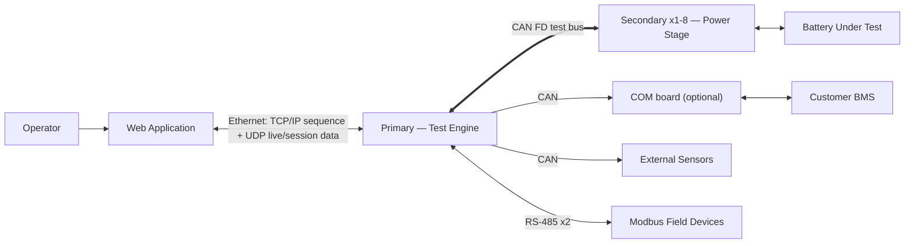

# System-Level PRD — ME Battery Test System

| | |
|---|---|
| **Document ID** | BTS-ME-SPRD-001 |
| **Version** | 1.0 |
| **Date** | 2026-08-03 |
| **Audience** | Senior Management / Product Steering |
| **Status** | For Review |
| **Prepared by** | Firmware Engineering |
| **Supporting documents** | `OLD_BTS_vs_NEW_ME_Comparison.md`, `ME_Peripheral_Requirements.md`, `BTS_and_ME_System_Overview.pptx` |

---

## 1. Purpose

This document defines requirements for the **ME Battery Test System as a whole product** — the Web Application, the Primary board, the Secondary boards, the CAN bus connecting them, and the external interfaces to the battery, the customer's BMS, and the test bench's sensors and field devices.

It is written at system level: what each subsystem must do and how subsystems must interact, not individual pin assignments (see `ME_Peripheral_Requirements.md` for board-level detail) and not a change log against the current product (see `OLD_BTS_vs_NEW_ME_Comparison.md` for that).

## 2. System Definition

The ME Battery Test System is a test bench that charges and discharges batteries under a programmed test sequence, records the results, and enforces safety limits — while allowing **one Primary controller to run up to eight independent battery channels** instead of one.

| Subsystem | Role |
|---|---|
| **Web Application** (PC/Server) | Author test sequences, configure batteries, run the bench, view live data, store results |
| **Primary board** | The test engine: stores sequences, interprets and executes steps, evaluates cutoffs, masters the CAN bus, talks to the PC |
| **Secondary board** (×1–8) | The power stage: regulates current/voltage to a received target, measures the battery, enforces local protection, reports data |
| **CAN FD test bus** | Shared link carrying targets down and measurements up between Primary and up to 8 Secondaries |
| **COM board** (optional) | BMS CAN-database logging, retained only on variants that need it |
| **Battery under test** | Connected to each Secondary's analog power path |
| **Customer BMS** | External device on its own CAN network, read via the COM board when fitted |
| **External sensors** | Bench-mounted sensors read by the Primary over a dedicated CAN bus |
| **Field devices (Modbus)** | Instruments/actuators read over RS-485 |

## 3. System Context

## 4. Actors / Users

| Actor | Interaction with the system |
|---|---|
| Test operator | Authors sequences, starts/stops/monitors tests, reviews reports via the Web Application |
| Customer BMS | Exchanges data with the COM board over its own CAN network |
| Maintenance/calibration technician | Runs calibration routines via the Web Application and board-level interfaces |
| Product Management | Owns open decisions on bus speed, storage resolution, upgrade path (Section 11) |

## 5. External Interfaces (System Boundary)

| Interface | Endpoints | Protocol | Direction | Notes |
|---|---|---|---|---|
| I1 | Web App ↔ Primary | Ethernet — TCP/IP | PC → Primary | Sequence download, commands, configuration |
| I2 | Web App ↔ Primary | Ethernet — UDP | Primary → PC | Live measurements, session data |
| I3 | Primary ↔ Secondary (×8) | CAN FD, 1 Mbit/s arbitration / 2 Mbit/s data phase | Both | Targets down, grouped measurements + priority fault alerts up |
| I4 | Primary ↔ COM board | CAN | Both | CAN-database traffic for BMS logging, when COM is fitted |
| I5 | COM board ↔ Customer BMS | CAN | Both | Customer's own network — physically separate from the test bus |
| I6 | Primary ↔ External sensors | CAN | Sensors → Primary | Bench-mounted sensor data |
| I7 | Primary ↔ Field devices | RS-485 ×2 | Both | Modbus |
| I8 | Secondary ↔ Battery | Analog power path | Both | Drive + measurement |

## 6. Functional Requirements

### 6.1 Web Application

| ID | Requirement |
|---|---|
| FR-W1 | Author and encode a test sequence, and assign it to one of eight programme slots |
| FR-W2 | Attach battery and channel configuration to a sequence before transfer |
| FR-W3 | Discover the Primary on the network and transfer sequences over TCP/IP |
| FR-W4 | Receive and display live data for all 8 channels concurrently |
| FR-W5 | Store session results in a per-session database via a background write queue sized for 8-channel load |
| FR-W6 | Provide calibration screens and report/export functions unchanged from the current product |

### 6.2 Primary Board (Test Engine)

| ID | Requirement |
|---|---|
| FR-P1 | Store up to 8 independent test sequences in indexed, individually selectable slots |
| FR-P2 | Interpret and execute every step of a running sequence (operators, cycles, jumps, recording rate) for each active channel |
| FR-P3 | Run up to 8 sequence engines concurrently, one per channel |
| FR-P4 | Master the CAN FD bus: address each Secondary uniquely (1–8), send resolved current/voltage targets |
| FR-P5 | Receive and unpack grouped measurement readings from each Secondary |
| FR-P6 | Evaluate step-ending cutoff conditions per channel using bus-delivered measurement data |
| FR-P7 | Treat a Secondary's priority fault alert as pre-empting routine bus traffic and act on it (e.g., halt affected channel) |
| FR-P8 | Preserve existing PC-facing interfaces (I1, I2) unchanged |
| FR-P9 | Detect power loss, persist session/cycle state, and resume correctly on power restore |
| FR-P10 | Serve the BMS CAN-database, external sensor bus, and Modbus interfaces (I4, I6, I7) |

### 6.3 Secondary Board (Power Stage)

| ID | Requirement |
|---|---|
| FR-S1 | Receive a target current/voltage from the Primary over CAN FD, addressed to its own node |
| FR-S2 | Run the regulation control loop locally every 1 ms, independent of bus timing |
| FR-S3 | Measure current, voltage, and temperature each 1 ms cycle |
| FR-S4 | Group measurement readings and transmit them to the Primary at a bounded interval |
| FR-S5 | Enforce local voltage/current/temperature protection limits every cycle, acting immediately without waiting on the bus |
| FR-S6 | Send a priority-ranked alert immediately upon detecting a protection-limit violation |
| FR-S7 | Ramp drive to zero if no valid message is received from the Primary within a defined timeout |
| FR-S8 | Run identical firmware on every node; distinguish only by CAN node address |
| FR-S9 | Support calibration mode via the existing two-point calibration engine |

### 6.4 COM Board (Optional — BMS Logging)

| ID | Requirement |
|---|---|
| FR-C1 | Interpret the customer's CAN database and log BMS traffic, when fitted |
| FR-C2 | Keep the BMS/customer CAN network physically separate from the Primary–Secondary test bus at all times |

## 7. Non-Functional Requirements

| ID | Requirement | Rationale |
|---|---|---|
| NFR-1 | Protection reaction time ≈1 ms, matching the current shipping product | Cutoff decisions on the Primary alone would take ~10 ms — unsafe; protection must stay local (FR-S5) |
| NFR-2 | CAN FD test bus utilisation stays below 70% at full 8-channel, 1 ms measurement load | Above this, message loss and unfair node starvation occur |
| NFR-3 | No measurement data loss at the chosen storage resolution (Section 11, D3) | Data integrity for customer reports |
| NFR-4 | Existing PC ↔ Primary protocols (I1, I2) require zero changes | Protects the existing Web Application investment; removes schedule risk |
| NFR-5 | One Primary fault must not silently corrupt more than the channels it directly serves | Fault isolation trade-off inherent to centralising control (see Risk R2) |
| NFR-6 | The Web Application's session database and write queue must sustain 8× the current per-channel data rate without loss | Scale requirement driven by FR-W5 |
| NFR-7 | A new test operator or cutoff type must ship as a Primary-only firmware release, requiring no change to installed Secondaries | Core maintainability goal of the redesign |

## 8. System Constraints

- **CAN bandwidth ceiling.** Eight Secondaries reporting 8 bytes every millisecond require exactly 1 Mbit/s — the entire capacity of standard CAN. **Standard CAN cannot meet this requirement at any speed; CAN FD with grouped readings (8 readings/message) is mandatory**, bringing bus load to ~30%. (Full derivation: `OLD_BTS_vs_NEW_ME_Comparison.md`, Section 7.)
- **Non-volatile storage.** Eight programme slots at today's worst-case 1 MB/sequence would exceed the current 4 MB device; sizing must be based on real customer sequence sizes, not the theoretical maximum.
- **Board count.** A bench of 8 channels needs 1 Primary + 8 Secondaries (+1 COM board only if BMS logging is required), versus 24 boards today.

## 9. Risks (System Level)

| ID | Risk | Severity | Mitigation |
|---|---|---|---|
| R1 | Protection reaction time degrades from ~1 ms to ~10 ms if evaluated solely on the Primary | High — safety | FR-S5/S6: protection and fault alerting stay on the Secondary, independent of the bus |
| R2 | A single Primary fault now affects up to 8 channels instead of 1 | High | FR-S7 fail-safe timeout; watchdogs on both boards |
| R3 | Standard CAN cannot carry the required traffic at any speed | High | Mandate CAN FD with grouped readings before hardware design begins |
| R4 | Web Application database/write-queue has never been load-tested at 8-channel volume | Medium | Load-test FR-W5 before release; consider reduced storage resolution (D3) |
| R5 | BMS CAN-logging feature could regress if the COM board is dropped for cost reasons | Medium | Keep FR-C1/C2 as an explicit, priced option rather than silently removing it |

## 10. Open Decisions Requiring Management Input

| ID | Decision | Owner |
|---|---|---|
| D1 | Full 1 ms CAN FD reporting vs. reduced 2 ms standard-CAN reporting | Product Management |
| D2 | Is a stored reading required for every millisecond, or is reduced storage resolution acceptable? | Product Management |
| D3 | Is ME a new product line, or must existing installed Secondaries be field-upgradeable? | Product Management |
| D4 | Does BMS CAN logging (COM board) carry forward as a standard fitment or a paid option? | Product Management |
| D5 | Must all 8 channels run different sequences simultaneously? | Product Management |

## 11. Success Criteria

- All 8 channels run concurrently from one Primary with no measurement data loss (NFR-2, NFR-3).
- Protection reaction time measured on hardware at ≤1 ms (NFR-1).
- Web Application ingests and stores 8-channel live/session data without loss or backlog (NFR-6).
- A new cutoff type or operator ships as a Primary-only release with zero Secondary firmware changes (NFR-7).
- BMS logging (if fitted) continues to function with the test bus and BMS network kept physically separate (FR-C2).

## 12. References

| Document | Content |
|---|---|
| `OLD_BTS_vs_NEW_ME_Comparison.md` | Architecture comparison, CAN feasibility analysis, full risk register |
| `ME_Peripheral_Requirements.md` | Board-level peripheral list, pin assignments |
| `ME_PRD.md` | Delta-focused PRD: what changes vs. the current shipping product |
| `BTS_and_ME_System_Overview.pptx` / `NEW_ME_System_Overview.png` | Visual system map used as the basis for Section 3 and Section 6 |

---

*End of document.*
